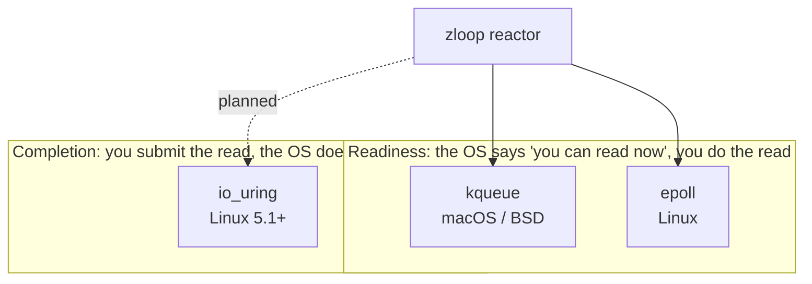

# Platform backends

The [reactor](reactor.md) is backend-agnostic on the surface -
`register` / `modify` / `unregister` / `poll` - but underneath it talks to a
different OS mechanism on each platform: **kqueue** on macOS and the BSDs,
**epoll** on Linux. Both answer the same question - *"which of these file
descriptors are ready?"* - so they map cleanly onto one interface.

This page explains how they differ, and how the newer **io_uring** relates (a
direction zloop plans to explore).

## Two levels of abstraction

The key idea up front: kqueue and epoll are **readiness** APIs, while io_uring is
a **completion** API. That's the real divide.



zloop uses kqueue and epoll today. io_uring is a future direction (see
[below](#io_uring-a-future-direction)).

## kqueue vs epoll

They solve the same problem and are conceptually twins. The differences are in
API shape and breadth:

| | **epoll** (Linux) | **kqueue** (macOS, BSD) |
| --- | --- | --- |
| Create | `epoll_create1()` | `kqueue()` |
| Register / modify / remove | `epoll_ctl()` - one syscall **per change** | `kevent()` - a **batch** of changelist entries |
| Wait for events | `epoll_wait()` - a separate syscall | `kevent()` - the **same** call submits changes *and* waits |
| What it can watch | fds (sockets, pipes, plus `timerfd` / `signalfd` / `eventfd`) | fds **and** timers, signals, process exit, file/vnode events - all unified |
| Interest model | one event **mask** per fd (`EPOLLIN \| EPOLLOUT`) | independent **filters** (`EVFILT_READ` and `EVFILT_WRITE` are *separate* registrations) |
| Timeout granularity | milliseconds | nanoseconds (`struct timespec`) |

The mental model: **same idea, different ergonomics.** kqueue is broader (one
mechanism for fds, timers, signals, and processes) and batches submit-and-wait
into a single call. epoll is fd-focused and leans on companion mechanisms
(`timerfd`, `signalfd`, `eventfd`) to cover what kqueue does in one place.

### What this means inside zloop

Three of these differences show up directly in `reactor.zig`:

1. **kqueue batches changes with the wait.** zloop accumulates registration
   changes and flushes them on the next `poll` - one `kevent()` submits them all
   and blocks for events. On epoll each change is its own `epoll_ctl` call.
2. **kqueue's read and write are separate filters; epoll's are one mask.** So
   "watch nothing on this fd" means *deleting both filters* on kqueue, but
   setting an empty mask on epoll. zloop maps empty interest to a zero epoll mask
   so a fully-unwatched fd doesn't keep firing hangup events.
3. **epoll's timeout is milliseconds; kqueue's is nanoseconds.** zloop rounds a
   sub-millisecond wait **up to 1ms** on epoll, so a tiny timer doesn't collapse
   into a zero-timeout busy-poll. kqueue needs no such rounding.

zloop deliberately does **not** push timers or signals into kqueue (even though
kqueue could host them natively). Keeping its own timer heap and a self-pipe for
signals means the timer logic is one piece of shared, cross-platform Zig, and the
two backends stay symmetric behind the same interface.

## io_uring: a future direction

[io_uring](https://en.wikipedia.org/wiki/Io_uring) (Linux 5.1+) is **not** a
readiness API - it's an **asynchronous completion** API, closer in spirit to
Windows IOCP than to epoll. The difference is fundamental:

=== "Readiness (epoll / kqueue)"

    ```text
    wait        ->  "socket is readable"   (the OS tells you it's ready)
    read(fd)    ->  you make the syscall to actually read the bytes
    ```

=== "Completion (io_uring)"

    ```text
    submit "read(fd, buf)"   ->  you describe the operation up front
      ... do other work ...
    reap        ->  "that read finished, N bytes are already in buf"
    ```

Mechanically, io_uring shares two ring buffers between your process and the
kernel: a **submission queue** you write operations into, and a **completion
queue** the kernel posts results to. The advantages:

* **Far fewer syscalls** - many operations batch into one `io_uring_enter()`, and
  with kernel-side polling you can reach *zero* syscalls in steady state. epoll
  and kqueue still cost a syscall to learn readiness *plus* one per
  `read`/`write`.
* **Truly async for things with no readiness model** - regular file I/O,
  `fsync`, `accept`, `connect`, even `openat`. (To epoll a disk file is "always
  ready" yet a `read` on it can still block; io_uring can do it asynchronously.)

The cost is a more complex model - you manage the rings, buffer ownership across
the async gap, and behavior that varies by kernel version - and it is Linux-only
and comparatively new.

### How it would fit zloop

!!! info "Planned, not built"
    An io_uring backend is on the roadmap; it isn't implemented yet. zloop runs
    on kqueue and epoll today.

It would be a **third backend with a different internal contract**, not a drop-in
swap. The reactor's job changes from *"register interest, report readiness,
caller does the I/O"* to *"submit operations, report completions"* - and that
ripples up into the [transport](transports.md), which would hand the kernel a
buffer and await "done" rather than waiting for "readable" and then reading.

io_uring also has a `POLL_ADD` operation that behaves like epoll, so it *can* be
adopted incrementally as a readiness backend first, then deepened into true
completion I/O. That's the likely path - the same way libuv and uvloop have been
gaining io_uring support - and it's an **addition** for the Linux fast path,
precisely because completion is a different shape from readiness.
