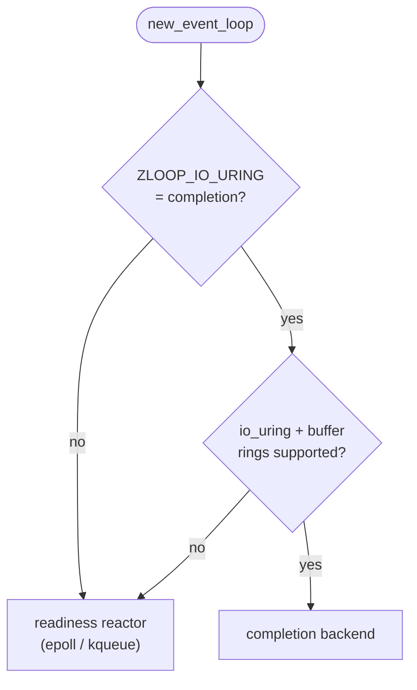
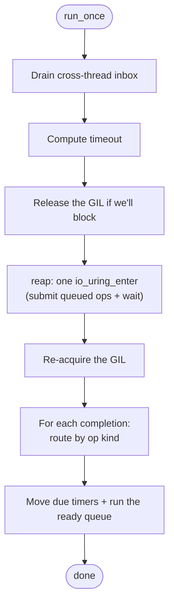
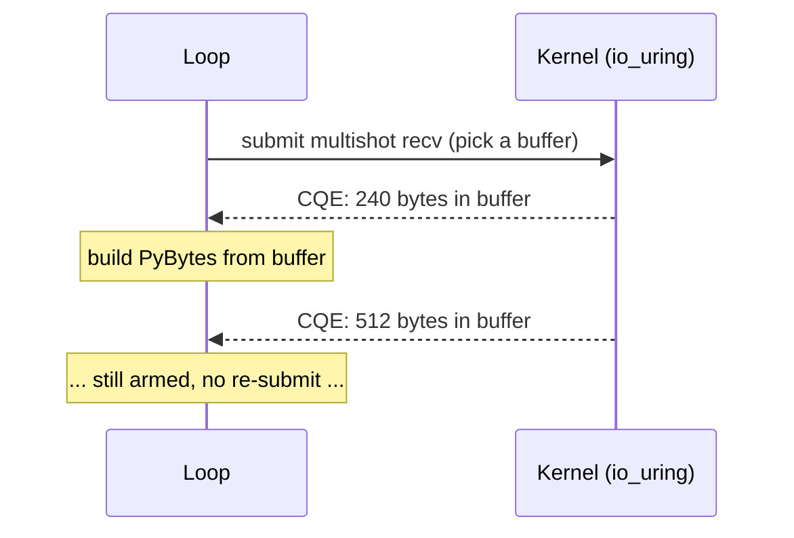

# The completion backend (io_uring)

The [reactor](the-loop.md) is zloop's default: it asks the OS *"which sockets are
ready?"* and the loop then does the `recv`/`send` itself. That's the **Reactor**
pattern, and it's what runs on macOS (kqueue) and on Linux (epoll).

Linux has a second I/O model, and zloop has a second backend for it: an **io_uring
completion port**. Instead of "which fds are ready?", it asks the kernel to *do
the I/O* and tell you when it's done - the kernel moves the bytes and posts a
result. That's the **Proactor** pattern.

It's opt-in, off by default, and Linux-only:

```bash
ZLOOP_IO_URING=completion uvicorn app:app --loop zloop:new_event_loop
```

When it's worth it - and when it isn't - is covered in
[Performance](../reference/performance.md). This page is about *how it works*.

## Readiness vs completion

The completor is a **sibling** of the reactor, not a wider reactor. Readiness and
completion are genuinely different contracts, so zloop doesn't try to hide one
behind the other:

| | **Reactor** (readiness) | **Completor** (completion) |
| --- | --- | --- |
| Question | "which fds are ready?" | "here are the bytes I moved" |
| Who does the `recv`/`send` | the loop, after the notification | the kernel, before the notification |
| Callback gets | an `IoEvent` (readable/writable/hup) | an `IoResult` (op kind + byte count + buffer) |
| Pattern | Reactor | Proactor |

The `Loop` holds an *optional* completor and, in its
[run-once cycle](the-loop.md#the-run-once-cycle), branches into one of two arms:
either it polls the reactor and fires reader/writer callbacks, or it reaps
completions and routes them. They're separate on purpose - a recv-completion
carrying bytes simply isn't the same event as "this fd became readable."

## Chosen at runtime, with a fallback

The kqueue-vs-epoll choice is made at *compile time* (it's just the target OS).
io_uring is different: a binary built for Linux still has to cope with kernels
that are too old, or a container that forbids the syscalls. So the completion
backend is selected at **runtime**:



If the env var isn't set, or the kernel lacks io_uring or provided-buffer rings,
the loop quietly stays on the readiness reactor. Enabling the backend builds the
ring *in place* - the buffer group stores a pointer back into its own ring, so
the completor has to be initialised at its final address rather than moved.

## The run-once cycle, completion-style

The shape is the same as the [readiness cycle](the-loop.md#the-run-once-cycle) -
drain cross-thread work, compute a timeout, release the GIL while blocked - but
the I/O step is a single `reap`:



The whole turn is **one trip into the kernel**. That's the core idea, and the
next two sections are how it's achieved.

### Batched submit: one `io_uring_enter` per turn

Every operation - recv, send, the readiness polls, cancels, even the
wait-bounding timeout - is only *queued*, never submitted on its own. Each grabs
a submission-queue entry and, only if the ring is momentarily full, flushes and
retries. The single actual flush is the `submit_and_wait` inside `reap`, which
submits everything accumulated this turn **and** blocks for completions in one
syscall.

So a busy loop turn that recv'd a message and queued a send back costs *one*
`io_uring_enter`, not one per operation. (An earlier design submitted each op
eagerly and did far more syscalls than even epoll; batching is what made the
completion backend competitive.)

Two ring-setup flags reinforce this. Each loop owns its ring on a single thread,
so the ring is created with `SINGLE_ISSUER`; `DEFER_TASKRUN` then tells the kernel
to process completions only when we call `submit_and_wait`, instead of in random
task-work context. That cuts cross-thread kernel overhead that would otherwise
grow with the number of parallel loops - which is exactly the
[free-threaded](#free-threaded-scaling) case the backend targets. If the kernel
rejects the flags, it falls back to a plain ring.

### Reads: multishot recv from a provided-buffer ring

On the readiness path, the loop `recv`s into a buffer it owns. The completion
path inverts this: the kernel owns a pool of buffers (a **provided-buffer ring**,
1024 × 64 KiB), and a single **multishot** recv stays armed and posts one
completion *per arrival*, each time telling us which buffer it filled.



Because it's multishot, the transport **never re-issues a recv per message** - the
kernel keeps delivering. The loop only re-arms in the rare case where the kernel
drops the "more coming" flag (for example, the buffer pool momentarily ran dry)
and the connection is still being read.

When a recv completion arrives, the loop hands the transport the kernel-filled
slice, the transport copies it into a `PyBytes` (with the GIL held) for
`data_received`, and then the buffer is **recycled** back to the ring for reuse.
That copy-out of the ring buffer is the one structural cost the readiness path
doesn't pay (it reads straight into the `PyBytes`); it's negligible for the small
messages this backend is tuned for.

### Writes: SEND on the ring

Writes are submitted as io_uring `SEND` operations and reaped on completion -
there's no synchronous `write()` syscall per message; the send batches into the
same turn's `io_uring_enter` as everything else.

The catch is lifetime: the kernel **borrows** the send buffer until the operation
completes. So the transport keeps exactly one send in flight per connection from a
*stable* buffer, while bytes written in the meantime accumulate in a second
buffer and are promoted when the in-flight send finishes. A partial send just
resubmits the remainder. This is the same pinned-buffer discipline a Proactor
write always needs.

## Routing completions: generations

All of a connection's completions - recv, send, and any readiness poll - come back
through one kernel queue. Each operation is tagged with a 64-bit `user_data` packed
as `[ generation | kind | fd ]`. The **kind** lets `reap` route a completion
without a side table; the **generation** filters stale ones.

Why generations matter: a file descriptor can be closed and a new one opened with
the same number, and a completion for the *old* fd might still be in flight. Each
fd carries a per-op-family generation counter (recv, send, and poll are
independent), bumped on every (re)submission and cancel. When a completion comes
back, the loop compares its generation against the current one for that fd and op
family; a mismatch means the op was superseded or the fd was reused, so the
completion is dropped (and any buffer recycled) instead of delivered.

The three families are independent for a real correctness reason: a data recv and
a write-readiness poll can be in flight on the *same* fd at once. A single shared
counter would let arming write-interest bump the recv's generation and make its
completion look stale - silently dropping received bytes. (There's a regression
test for exactly that.)

## Readiness, even here: POLL_ADD

Not every fd is a plain data socket. Listening sockets (accept), connecting
sockets (connect), signal fds, and the loop's own wake pipe need *readiness*, not
a buffered recv. On the completion backend those use a multishot `POLL_ADD`: the
kernel reports the poll mask, and the loop fires the fd's reader/writer callbacks
exactly like the reactor would. This is how `add_reader` / `add_writer` keep
working when io_uring is on.

It's also why the wake pipe moves onto a `POLL_ADD` when the backend is enabled -
a buffered recv on a pipe is the wrong tool. One subtlety: multishot poll is
*edge-triggered*, unlike level-triggered epoll, so connections that stay on the
readiness path (buffered/SSL protocols, whose `get_buffer()` memory the kernel
can't borrow) drain each readable fd until `EAGAIN` rather than waiting for a
re-fire.

## Free-threaded scaling

For a single GIL-bound loop, the completion backend is *slower* than readiness -
the per-message ring bookkeeping and the buffer copy-out aren't worth it when one
serialized loop is the bottleneck. Its win is **free-threaded CPython** (3.14t):
with the GIL off, N independent loops run on N threads in real parallel, and the
batched-submit / `DEFER_TASKRUN` design keeps each loop's kernel overhead low as
the thread count climbs. That's the configuration where it pulls ahead of both
zloop's own epoll backend and uvloop - see [Performance](../reference/performance.md)
for the numbers.
