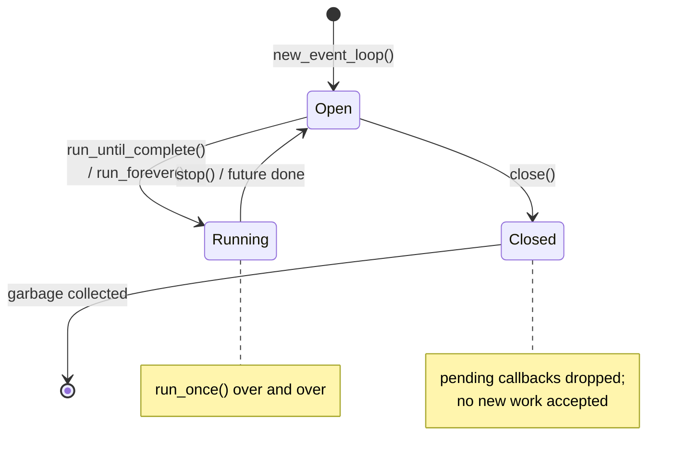
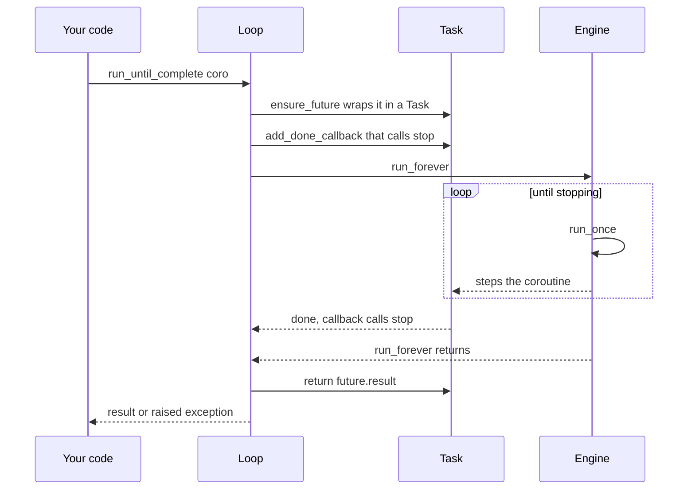

# Loop lifecycle

Let's trace a loop from birth to death, so the pieces from the previous pages
connect into one story.

## States



A loop is **Open** when created, becomes **Running** while it's driving
callbacks, returns to **Open** when stopped, and is **Closed** for good once you
`close()` it.

## `run_until_complete`, step by step

This is the method `asyncio.run()` ultimately calls. zloop implements it exactly
the way asyncio does:



The trick is the done-callback: when the wrapped task finishes, it calls
`loop.stop()`, which breaks the `run_forever` loop. Then `run_until_complete`
returns the task's result - or re-raises its exception.

If the loop is stopped *before* the future completes, zloop raises a clear
`RuntimeError("Event loop stopped before Future completed.")`, matching asyncio
rather than leaking an obscure internal error.

## Shutdown and cleanup

`asyncio.run()` does a tidy shutdown sequence, and zloop participates in all of
it:

1. cancel any remaining tasks and let them finish cancelling,
2. `await loop.shutdown_asyncgens()` - a no-op today: zloop doesn't install
   asyncgen finalizer hooks, so this is a compatibility placeholder (the method
   exists and is safe to call),
3. `await loop.shutdown_default_executor()` - drain the thread pool,
4. `loop.close()`.

That last `close()` does something important for memory: it **drops the engine's
pending callbacks and timers**. This breaks a reference cycle - the engine holds
pending callback handles, and each handle holds a reference back to the loop - so
that once you're done, the loop can be garbage-collected cleanly.

!!! tip "Always close your loop"
    If you create a loop by hand, `close()` it when you're done (a `try/finally`
    is the idiom). `asyncio.run()` and `asyncio.Runner` do this for you - which is
    why they're the recommended way to run things. A loop that's *abandoned*
    without being closed, while callbacks are still pending, can't break that
    cycle and will leak.

## After close

A closed loop is inert and says so. Calling `call_soon`, `call_later`,
`add_reader`, or `create_server` on a closed loop raises
`RuntimeError("Event loop is closed")` - exactly like asyncio. No silent enqueuing
onto a loop that will never run again.

```python
import asyncio

import zloop

loop = zloop.new_event_loop()
loop.close()

loop.call_soon(print, "nope")
#> RuntimeError: Event loop is closed
```

And that's the whole life of a zloop loop. 🙂
