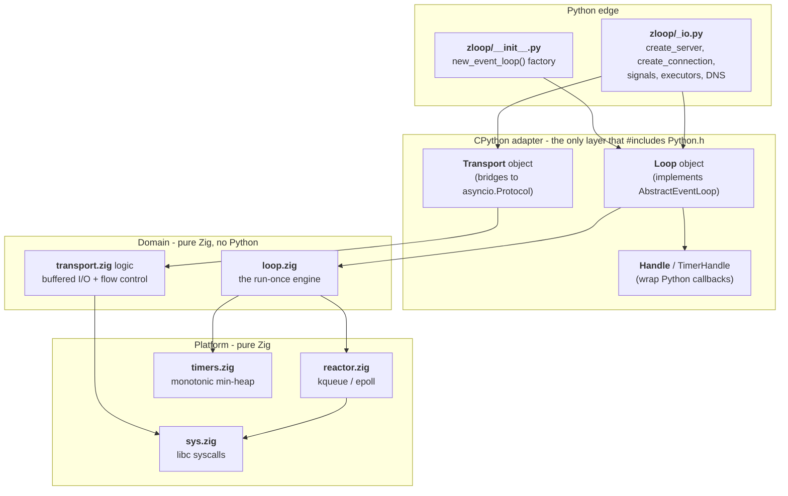

# Architecture overview

So how does a Zig program become a Python event loop?

This section is the fun part. You don't need any of it to *use* zloop - but if
you're curious how the pieces fit (or you want to hack on it), let's open it up.

## The big idea

An event loop has two halves:

1. **The engine** - the part that actually waits for I/O, fires timers, and runs
   callbacks. This is "the loop" in *event loop*.
2. **The coroutine machinery** - `Future`, `Task`, the rules for stepping
   coroutines. This is subtle, and CPython already gets it right.

zloop writes the **engine in Zig**, and **reuses CPython's coroutine machinery**.
That's the same boundary [uvloop](https://github.com/MagicStack/uvloop) draws -
and it's the key to being both fast *and* correct.

!!! quote "The one-sentence summary"
    The loop *engine* lives in Zig; CPython keeps driving the coroutines. zloop
    is the adapter that makes the two speak to each other.

## The layers

zloop is built in clean layers, each depending only on the one below it. The
*domain* - the event loop itself - has no idea CPython exists. CPython is an
adapter bolted on at the edge.

Reading it bottom-up:

* **[`reactor.zig`](reactor.md)** - the kqueue/epoll demultiplexer. Knows nothing
  about Python or callbacks; it maps file descriptors to readiness.
* **[`loop.zig`](the-loop.md)** - the actual event loop: timer heap, ready queue,
  and the `run_once` cycle that drives everything.
* **The CPython adapter** - the `Loop`, `Transport`, and `Handle` Python types.
  The *only* layer that touches `Python.h`. It translates Python objects into Zig
  calls and back.
* **The Python edge** - a thin `Loop` subclass that does one-time connection
  setup choreography (binding sockets, resolving names), plus the
  `new_event_loop` factory.

## Why this shape?

Because it lets each layer be **simple and testable on its own**:

* The reactor is tested with real sockets, in pure Zig, with zero Python.
* The loop engine is tested with a fake "dispatcher", in pure Zig.
* The adapter is tested behaviorally, through the public asyncio API.

And it lets us reuse CPython exactly where reuse is the *responsible* choice -
coroutine stepping and TLS - instead of reimplementing famously-subtle code. See
[What zloop reuses](reuse.md).

## What's next

-   :material-radar: **[The reactor](reactor.md)** - kqueue/epoll, the I/O layer.

-   :material-sync: **[The loop](the-loop.md)** - the run-once cycle.

-   :material-swap-horizontal: **[Transports](transports.md)** - sockets → protocols.

-   :material-recycle: **[What's reused](reuse.md)** - the asyncio boundary.

-   :material-timer-sand: **[Lifecycle](lifecycle.md)** - startup, run, shutdown.

