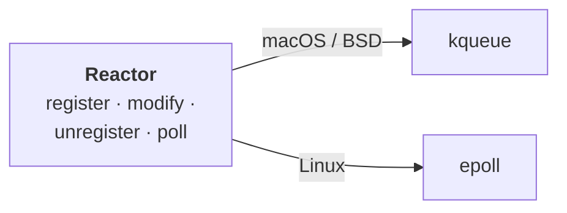

# The reactor

At the very bottom of zloop sits the **reactor** - the piece that asks the
operating system *"which of these sockets are ready?"* and waits efficiently
until at least one is.

This is the [Reactor pattern](https://en.wikipedia.org/wiki/Reactor_pattern), and
it's deliberately the dumbest, purest layer in the whole system. It knows about
file descriptors and readiness. It knows **nothing** about Python, callbacks,
timers, or transports.

## One interface, two backends

Operating systems expose readiness differently. zloop wraps both behind one tiny,
backend-agnostic API (`src/core/reactor.zig`):



The right backend is chosen at **compile time** from the target OS - there's no
runtime branching.

## The API

The whole reactor is four operations:

| Operation | What it does |
| --- | --- |
| `register(fd, token, interest)` | Start watching `fd` for read and/or write |
| `modify(fd, token, interest)` | Change what we're watching `fd` for |
| `unregister(fd)` | Stop watching `fd` |
| `poll(out, timeout_ns)` | Block until something is ready (or the timeout) |

A few design choices worth calling out:

* **`interest`** is a tiny bitset - `{ read, write }`. That's all the loop ever
  needs to express.
* **`token`** is an opaque `usize` the caller hands in. The reactor stores it and
  hands it straight back in the readiness event. The reactor never interprets it.
  (The loop uses the fd itself as the token, so it can find the fd's state fast.)
* **`poll`** writes results into a caller-provided buffer and returns the slice
  that was filled - no allocation in the hot path.

## What `poll` gives back

Each ready fd produces an `Event`:

```zig
pub const Event = struct {
    token: usize,    // whatever you registered
    readable: bool,  // ready to read
    writable: bool,  // ready to write
    hup: bool,       // peer hung up, or an error - let reads/writes observe it
};
```

That `hup` flag is a small but important detail: when a connection drops, the
loop wants the pending read or write to *run* and discover the EOF/error, rather
than silently doing nothing. So a hangup is reported as "go look at this fd".

## The timeout

`poll(out, timeout_ns)` is where the loop actually *sleeps*:

* `null` → block forever (until something is ready)
* `0` → don't block, just report what's ready right now
* `n` → block up to `n` nanoseconds

The loop computes this timeout from the nearest timer (see
[The loop](the-loop.md)) so it sleeps exactly as long as it should - no busy
spinning, no oversleeping.

!!! info "kqueue vs epoll subtleties"
    The two backends aren't quite symmetric, and zloop papers over the
    differences so the layer above doesn't care:

    * **kqueue** registers read and write as two independent "filters", so
      dropping all interest deletes both. **epoll** uses a single event mask, so
      zloop maps "no interest" to a zero mask (no stray hangup notifications).
    * **epoll**'s timeout is in milliseconds, so sub-millisecond waits are
      rounded *up* to 1ms - exactly what asyncio does - to avoid degrading into a
      zero-timeout busy-poll.

## Tested in isolation

Because the reactor has no Python in it, it's tested as plain Zig - with real
pipes and socket pairs:

```console
$ zig build test
```

This runs unit tests for the reactor (and the timer heap, and the ready queue)
directly, without ever starting CPython. That separation is the payoff of keeping
this layer pure. 🙂
