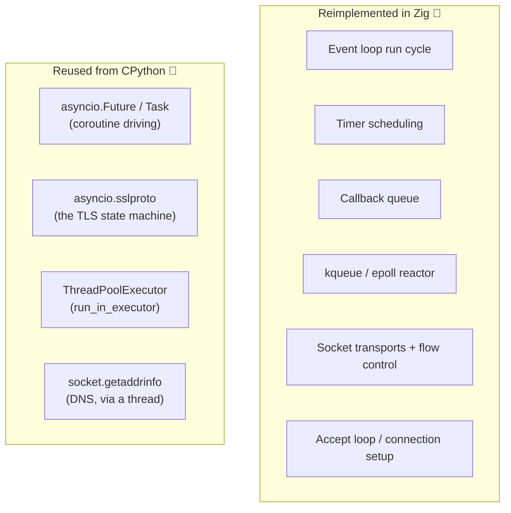
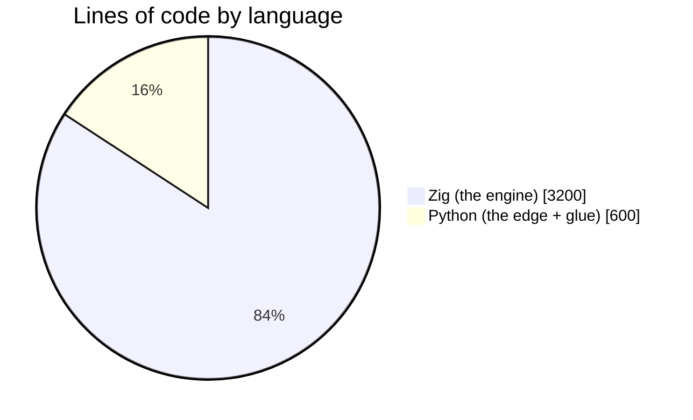

# What zloop reuses

A recurring question: *if zloop is a "from-scratch event loop in Zig", why does
it import `asyncio` at all?*

Because rewriting code that CPython already gets right would be reckless, not
impressive. The art is drawing the boundary in the right place - and that
boundary is the same one uvloop draws.

## The rule

> Reimplement the **mechanism** (waiting, scheduling, moving bytes). Reuse the
> **semantics** that are subtle, correct, and already C-accelerated.

## Why reuse each of these?

### `Future` and `Task`

Stepping a coroutine correctly - cancellation, exception propagation, `contextvars`
context, chaining - is genuinely subtle, and CPython's `_asyncio` implements it in
C. uvloop reuses it. zloop reuses it. `loop.create_future()` returns a real
`asyncio.Future`; `loop.create_task()` returns a real `asyncio.Task`.

!!! quote
    This is also why `create_future` benchmarks identically across asyncio,
    uvloop, and zloop: all three are calling the *same* C-accelerated object.
    There's nothing to "win" there - and reimplementing it would only add bugs.

### `asyncio.sslproto`

TLS is a state machine wrapped around a buffered protocol. asyncio's
`SSLProtocol` is pure Python, loop-agnostic, and battle-tested - it only needs a
loop with `call_soon`/`call_later` and a transport to drive. zloop gives it
exactly that, by feeding it ciphertext through a Zig transport. So TLS behaves
*identically* to the default loop, with zero TLS code in zloop itself.

### Executors and DNS

`run_in_executor` wraps a `concurrent.futures` pool - no reason to reinvent
thread pools. And `getaddrinfo` is blocking, so DNS resolution is dispatched to a
thread through that same executor. Standard asyncio strategy.

## So what's actually zloop?

Everything that makes it an *event loop*: the run cycle, the timer heap, the
callback queue, the kqueue/epoll reactor, the socket transports, the accept loop,
the flow control, the signal handling, the GIL bracketing, the self-pipe wakeup.

That's the part where performance lives, and that's the part written in Zig.

The numbers are approximate, but the shape is the point: the **engine** is Zig;
the Python is a thin, readable edge that does connection-setup choreography and
hands work to the engine.
