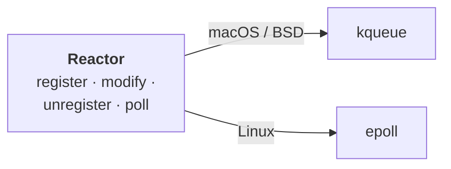
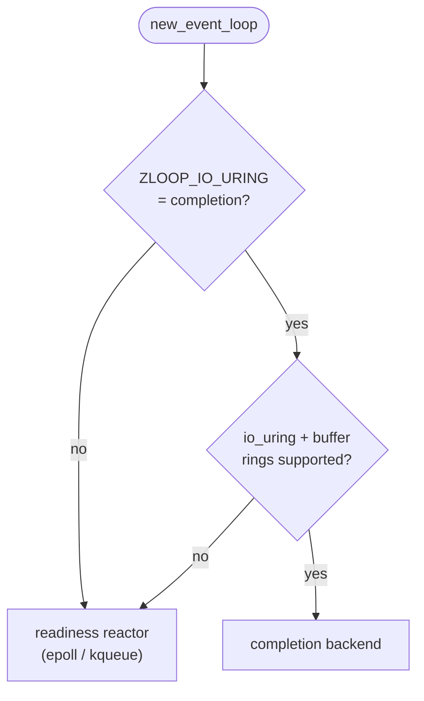
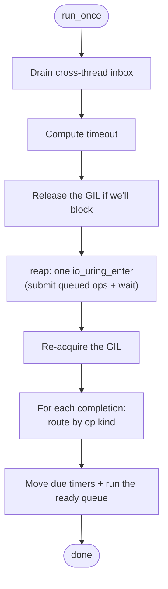
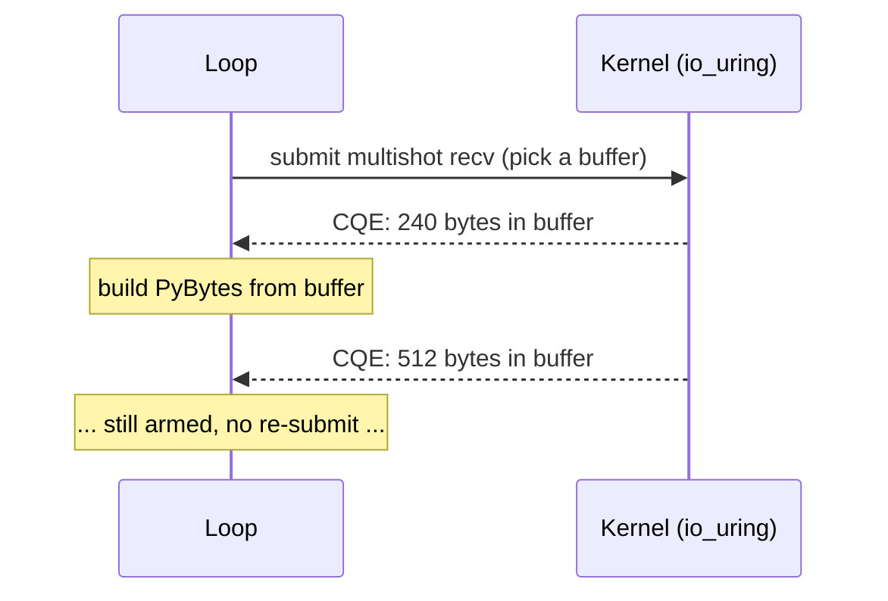
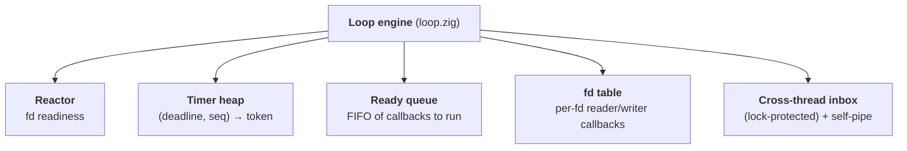
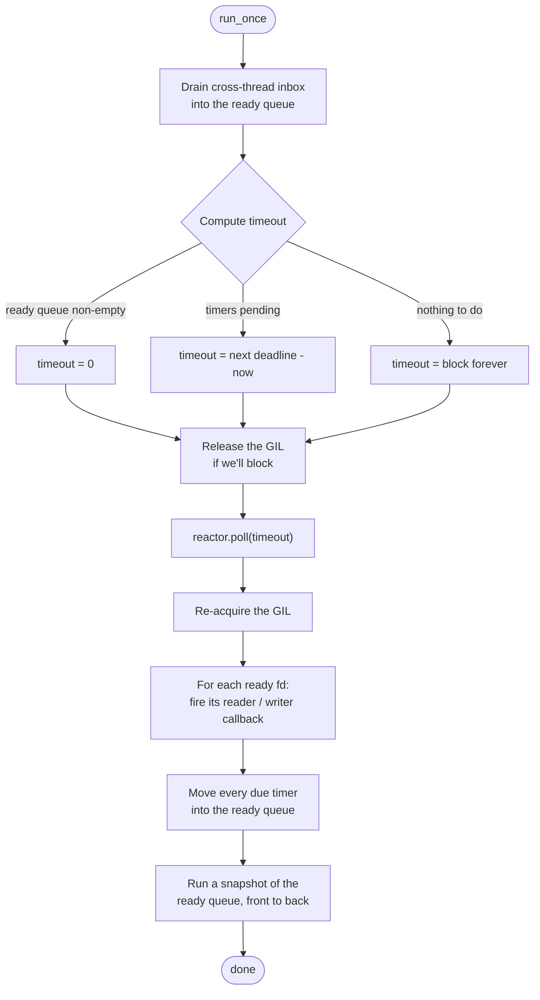
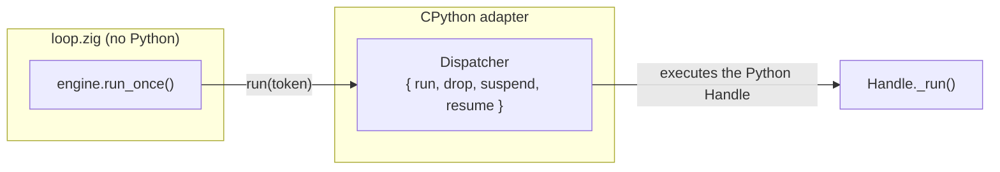

# The loop & the I/O backends

This is the heart of zloop: a tiny **reactor** that asks the OS *"which sockets
are ready?"*, and the **loop engine** that turns reactor readiness plus a timer
heap into an actual event loop - the thing that runs forever, waking when there's
work and sleeping when there isn't.

On Linux there's also a second I/O engine - an **io_uring completor** - that
flips the question around: instead of *"which sockets are ready?"* it asks the
kernel to *do the I/O* and tell you when it's done. It's opt-in, and we'll get to
it once the reactor makes sense.

So we'll build it bottom-up: the reactor first, then the completor that sits
beside it, and finally the engine on top of both.

## The reactor

At the very bottom sits the **reactor** - the piece that waits efficiently until
at least one watched file descriptor is ready.

This is the [Reactor pattern](https://en.wikipedia.org/wiki/Reactor_pattern), and
it's deliberately the dumbest, purest layer in the whole system. It knows about
file descriptors and readiness. It knows **nothing** about Python, callbacks,
timers, or transports.

### One interface, two backends

Operating systems expose readiness differently. zloop wraps both behind one tiny,
backend-agnostic API (`src/core/reactor.zig`):



The right *readiness* backend is chosen at **compile time** from the target OS -
there's no runtime branching between kqueue and epoll.

!!! note "There's also a completion backend"
    The reactor is zloop's default and what this section is about. Linux also has
    an opt-in io_uring **completion** backend - a different I/O model entirely,
    selected at *runtime* via `ZLOOP_IO_URING=completion`. We cover it further
    down, in [The completion backend (io_uring)](#the-completion-backend-io_uring).

### The API

The whole reactor is four operations:

| Operation | What it does |
| --- | --- |
| `register(fd, token, interest)` | Start watching `fd` for read and/or write |
| `modify(fd, token, interest)` | Change what we're watching `fd` for |
| `unregister(fd)` | Stop watching `fd` |
| `poll(out, timeout_ns)` | Block until something is ready (or the timeout) |

A few design choices worth calling out:

* **`interest`** is a tiny bitset - `{ read, write }`. That's all the loop ever
  needs to express.
* **`token`** is an opaque `usize` the caller hands in. The reactor stores it and
  hands it straight back in the readiness event. The reactor never interprets it.
  (The loop uses the fd itself as the token, so it can find the fd's state fast.)
* **`poll`** writes results into a caller-provided buffer and returns the slice
  that was filled - no allocation in the hot path.

### What `poll` gives back

Each ready fd produces an `Event`:

```zig
pub const Event = struct {
    token: usize,    // whatever you registered
    readable: bool,  // ready to read
    writable: bool,  // ready to write
    hup: bool,       // peer hung up, or an error - let reads/writes observe it
};
```

That `hup` flag is a small but important detail: when a connection drops, the
loop wants the pending read or write to *run* and discover the EOF/error, rather
than silently doing nothing. So a hangup is reported as "go look at this fd".

### The timeout

`poll(out, timeout_ns)` is where the loop actually *sleeps*:

* `null` → block forever (until something is ready)
* `0` → don't block, just report what's ready right now
* `n` → block up to `n` nanoseconds

The loop computes this timeout from the nearest timer (see
[the run-once cycle](#the-run-once-cycle)) so it sleeps exactly as long as it
should - no busy spinning, no oversleeping.

### Tested in isolation

Because the reactor has no Python in it, it's tested as plain Zig - with real
pipes and socket pairs:

```console
$ zig build test
```

This runs unit tests for the reactor (and the timer heap, and the ready queue)
directly, without ever starting CPython. That separation is the payoff of keeping
this layer pure. 🙂

## Platform backends: kqueue vs epoll

The reactor is backend-agnostic on the surface, but underneath it talks to a
different OS mechanism on each platform: **kqueue** on macOS and the BSDs,
**epoll** on Linux. Both answer the same question - *"which of these file
descriptors are ready?"* - so they map cleanly onto one interface.

They solve the same problem and are conceptually twins. The differences are in
API shape and breadth:

| | **epoll** (Linux) | **kqueue** (macOS, BSD) |
| --- | --- | --- |
| Create | `epoll_create1()` | `kqueue()` |
| Register / modify / remove | `epoll_ctl()` - one syscall **per change** | `kevent()` - a **batch** of changelist entries |
| Wait for events | `epoll_wait()` - a separate syscall | `kevent()` - the **same** call submits changes *and* waits |
| What it can watch | fds (sockets, pipes, plus `timerfd` / `signalfd` / `eventfd`) | fds **and** timers, signals, process exit, file/vnode events - all unified |
| Interest model | one event **mask** per fd (`EPOLLIN \| EPOLLOUT`) | independent **filters** (`EVFILT_READ` and `EVFILT_WRITE` are *separate* registrations) |
| Timeout granularity | milliseconds | nanoseconds (`struct timespec`) |

The mental model: **same idea, different ergonomics.** kqueue is broader (one
mechanism for fds, timers, signals, and processes) and batches submit-and-wait
into a single call. epoll is fd-focused and leans on companion mechanisms
(`timerfd`, `signalfd`, `eventfd`) to cover what kqueue does in one place.

Three of these differences show up directly in `reactor.zig`:

1. **kqueue batches changes with the wait.** zloop accumulates registration
   changes and flushes them on the next `poll` - one `kevent()` submits them all
   and blocks for events. On epoll each change is its own `epoll_ctl` call.
2. **kqueue's read and write are separate filters; epoll's are one mask.** So
   "watch nothing on this fd" means *deleting both filters* on kqueue, but
   setting an empty mask on epoll. zloop maps empty interest to a zero epoll mask
   so a fully-unwatched fd doesn't keep firing hangup events.
3. **epoll's timeout is milliseconds; kqueue's is nanoseconds.** zloop rounds a
   sub-millisecond wait **up to 1ms** on epoll, so a tiny timer doesn't collapse
   into a zero-timeout busy-poll. kqueue needs no such rounding.

zloop deliberately does **not** push timers or signals into kqueue (even though
kqueue could host them natively). Keeping its own timer heap and a self-pipe for
signals means the timer logic is one piece of shared, cross-platform Zig, and the
two backends stay symmetric behind the same interface.

## The completion backend (io_uring)

So far everything has been about **readiness**: the reactor asks *"which sockets
are ready?"*, and then the loop does the `recv`/`send` itself. That's the
**Reactor** pattern, and it's what runs on macOS (kqueue) and on Linux (epoll).

Linux has a second I/O model, and zloop has a second backend for it: an **io_uring
completion port**. Instead of *"which fds are ready?"*, it asks the kernel to *do
the I/O* and tell you when it's done - the kernel moves the bytes and posts a
result. That's the **Proactor** pattern.

It's opt-in, off by default, and Linux-only:

```bash
ZLOOP_IO_URING=completion uvicorn app:app --loop zloop:new_event_loop
```

When it's worth turning on - and when it isn't - is covered in
[Performance](../reference/performance.md). Here we care about *how it works*.

### Readiness vs completion

Here's the key thing to get: the completor is a **sibling** of the reactor, not a
fancier reactor. Readiness and completion are genuinely different contracts, so
zloop doesn't try to hide one behind the other.

| | **Reactor** (readiness) | **Completor** (completion) |
| --- | --- | --- |
| Question | "which fds are ready?" | "here are the bytes I moved" |
| Who does the `recv`/`send` | the loop, after the notification | the kernel, before the notification |
| Callback gets | an `IoEvent` (readable/writable/hup) | an `IoResult` (op kind + byte count + buffer) |
| Pattern | Reactor | Proactor |

The `Loop` holds an *optional* completor and, in its
[run-once cycle](#the-run-once-cycle), branches into one of two arms: either it
polls the reactor and fires reader/writer callbacks, or it reaps completions and
routes them. They're separate on purpose - a recv-completion carrying bytes simply
isn't the same event as "this fd became readable."

### Chosen at runtime, with a fallback

Notice that the kqueue-vs-epoll choice was made at *compile time* - it's just the
target OS. io_uring is different. A binary built for Linux still has to cope with
kernels that are too old, or a container that forbids the syscalls. So the
completion backend is selected at **runtime**:



If the env var isn't set, or the kernel lacks io_uring or provided-buffer rings,
the loop quietly stays on the readiness reactor - no error, it just uses what
works. Enabling the backend builds the ring *in place*: the buffer group stores a
pointer back into its own ring, so the completor has to be initialised at its
final address rather than moved.

### The run-once cycle, completion-style

The shape is the same as the [readiness cycle](#the-run-once-cycle) - drain
cross-thread work, compute a timeout, release the GIL while blocked - but the I/O
step collapses into a single `reap`:



The whole turn is **one trip into the kernel**. That's the core idea, and the next
couple of sections are how it's achieved.

#### Batched submit: one `io_uring_enter` per turn

Every operation - recv, send, the readiness polls, cancels, even the wait-bounding
timeout - is only *queued*, never submitted on its own. Each grabs a
submission-queue entry and, only if the ring is momentarily full, flushes and
retries. The single actual flush is the `submit_and_wait` inside `reap`, which
submits everything accumulated this turn **and** blocks for completions in one
syscall.

So a busy loop turn that recv'd a message and queued a send back costs *one*
`io_uring_enter`, not one per operation. (An earlier design submitted each op
eagerly and did far more syscalls than even epoll - batching is what made the
completion backend competitive.)

Two ring-setup flags reinforce this. Each loop owns its ring on a single thread,
so the ring is created with `SINGLE_ISSUER`; `DEFER_TASKRUN` then tells the kernel
to process completions only when we call `submit_and_wait`, instead of in random
task-work context. That cuts cross-thread kernel overhead that would otherwise
grow with the number of parallel loops - which is exactly the
[free-threaded](#free-threaded-scaling) case the backend targets. If the kernel
rejects the flags, it falls back to a plain ring.

#### Reads: multishot recv from a provided-buffer ring

On the readiness path, the loop `recv`s into a buffer it owns. The completion path
inverts this: the kernel owns a pool of buffers (a **provided-buffer ring**,
1024 × 64 KiB), and a single **multishot** recv stays armed and posts one
completion *per arrival*, each time telling us which buffer it filled.



Because it's multishot, the transport **never re-issues a recv per message** - the
kernel keeps delivering. The loop only re-arms in the rare case where the kernel
drops the "more coming" flag (for example, the buffer pool momentarily ran dry)
and the connection is still being read.

When a recv completion arrives, the loop hands the transport the kernel-filled
slice, the transport copies it into a `PyBytes` (with the GIL held) for
`data_received`, and then the buffer is **recycled** back to the ring for reuse.
That copy-out of the ring buffer is the one structural cost the readiness path
doesn't pay - it reads straight into the `PyBytes` - but it's negligible for the
small messages this backend is tuned for.

#### Writes: SEND on the ring

Writes are submitted as io_uring `SEND` operations and reaped on completion -
there's no synchronous `write()` syscall per message; the send batches into the
same turn's `io_uring_enter` as everything else.

The catch is lifetime: the kernel **borrows** the send buffer until the operation
completes. So the transport keeps exactly one send in flight per connection from a
*stable* buffer, while bytes written in the meantime accumulate in a second buffer
and are promoted when the in-flight send finishes. A partial send just resubmits
the remainder. This is the same pinned-buffer discipline a Proactor write always
needs.

### Routing completions: generations

All of a connection's completions - recv, send, and any readiness poll - come back
through one kernel queue. Each operation is tagged with a 64-bit `user_data` packed
as `[ generation | kind | fd ]`. The **kind** lets `reap` route a completion
without a side table; the **generation** filters stale ones.

Why do generations matter? A file descriptor can be closed and a new one opened
with the same number, and a completion for the *old* fd might still be in flight.
Each fd carries a per-op-family generation counter (recv, send, and poll are
independent), bumped on every (re)submission and cancel. When a completion comes
back, the loop compares its generation against the current one for that fd and op
family; a mismatch means the op was superseded or the fd was reused, so the
completion is dropped (and any buffer recycled) instead of delivered.

The three families are independent for a real correctness reason: a data recv and
a write-readiness poll can be in flight on the *same* fd at once. A single shared
counter would let arming write-interest bump the recv's generation and make its
completion look stale - silently dropping received bytes. (There's a regression
test for exactly that.)

### Readiness, even here: POLL_ADD

Not every fd is a plain data socket. Listening sockets (accept), connecting
sockets (connect), signal fds, and the loop's own wake pipe need *readiness*, not
a buffered recv. On the completion backend those use a multishot `POLL_ADD`: the
kernel reports the poll mask, and the loop fires the fd's reader/writer callbacks
exactly like the reactor would. This is how `add_reader` / `add_writer` keep
working when io_uring is on.

It's also why the wake pipe moves onto a `POLL_ADD` when the backend is enabled - a
buffered recv on a pipe is the wrong tool. One subtlety: multishot poll is
*edge-triggered*, unlike level-triggered epoll, so connections that stay on the
readiness path (buffered/SSL protocols, whose `get_buffer()` memory the kernel
can't borrow) drain each readable fd until `EAGAIN` rather than waiting for a
re-fire.

### Free-threaded scaling

One last thing, because it's the whole point of the backend. For a single
GIL-bound loop, the completion backend is *slower* than readiness - the per-message
ring bookkeeping and the buffer copy-out aren't worth it when one serialized loop
is the bottleneck.

Its win is **free-threaded CPython** (3.14t): with the GIL off, N independent loops
run on N threads in real parallel, and the batched-submit / `DEFER_TASKRUN` design
keeps each loop's kernel overhead low as the thread count climbs. That's the
configuration where it pulls ahead of both zloop's own epoll backend and uvloop -
see [Performance](../reference/performance.md) for the numbers.

## The loop engine

On top of the reactor sits the engine: `src/core/loop.zig`. It turns the reactor
and a timer heap into an actual *event loop*.

### What it owns

The engine's main pieces:



* **Ready queue** - callbacks scheduled with `call_soon`, waiting to run.
* **Timer heap** - a min-heap keyed by `(deadline, insertion order)`; the next
  thing to expire is always on top.
* **Reactor** - for fd readiness, from above.
* **fd table** - the reader/writer callback registered for each watched fd.
* **Cross-thread inbox** - a lock-protected queue that `call_soon_threadsafe`
  appends to, plus a self-pipe the loop watches so another thread (or a signal)
  can wake it from a blocking `poll`.

(It also keeps the running/stopping/closed state flags, of course.)

### The run-once cycle

Every iteration of the loop is one `run_once`. It's the canonical asyncio cycle,
and it's small enough to hold in your head:



A few things in that diagram carry real weight:

#### Computing the timeout

The loop sleeps *exactly* as long as it should. If there's already work queued,
the timeout is `0` (don't sleep). Otherwise it's the time until the nearest
timer. Otherwise - nothing scheduled at all - it blocks forever, until I/O or a
wakeup. No busy-spinning, no oversleeping.

#### Releasing the GIL :material-fire:

This is the detail that makes everything else work. While the loop is blocked in
`poll`, it **releases CPython's GIL** (`PyEval_SaveThread`) and re-acquires it
right after (`PyEval_RestoreThread`).

Without this, threads in your `run_in_executor` pool could never run, and signals
would never be delivered - the whole process would be frozen waiting on `poll`.
It's easy to get wrong, and it's why a "just call epoll" loop isn't enough.

#### Inline I/O, snapshot drain for the rest

There are two kinds of callback, and they run differently. A ready fd's
**native transport callback fires inline**, right there in the I/O step - that's
how `data_received` runs without a Python round-trip. A Python-level `add_reader`
callback, by contrast, just *enqueues* a Handle onto the ready queue.

When the loop then drains the ready queue, it runs a **snapshot** of its current
length. Callbacks that schedule *more* callbacks don't get run in the same
iteration - they wait for the next turn. This is the exact fairness guarantee
asyncio makes, and it prevents one chatty callback from starving I/O.

### Dependency inversion: how Zig calls Python

Here's the elegant bit. The loop engine runs callbacks - but the callbacks are
*Python* objects, and the engine is *Zig* that doesn't know Python exists. How?

The engine is parameterized by a **dispatcher** - a little vtable the embedder
supplies:



* `run(token)` - execute the callback identified by `token`. The adapter knows
  `token` is really a pointer to a Python `Handle`, and runs it.
* `drop(token)` - release a callback that will never run (e.g. on shutdown).
* `suspend` / `resume` - the GIL release/re-acquire around the blocking poll.

The engine just calls `dispatcher.run(token)`. It has no idea a Python function
is on the other end. That's **dependency inversion**: the pure domain defines the
*interface* it needs, and the adapter plugs CPython into it.

!!! tip "Why two kinds of callbacks?"
    Deferred callbacks (`call_soon`, timers) go through the dispatcher as opaque
    tokens → Python Handles. But **I/O readiness** callbacks (a transport's
    "you can read now") are *native Zig closures* registered directly with the
    engine - so socket I/O never makes a round trip through Python just to find
    out a byte arrived. The Python `add_reader` wrapper installs a closure that
    simply enqueues a Handle. Best of both.

### Running forever, and stopping

`run_forever` is just `while (!stopping) run_once(...)`. `stop()` sets the flag
and pokes the self-pipe so a blocked `poll` returns immediately.

`run_until_complete(future)` is built on top, exactly as asyncio does it: attach
a done-callback to the future that calls `stop()`, then `run_forever`, then return
the future's result. See [Transports & lifecycle](transports.md) for the full
picture.
