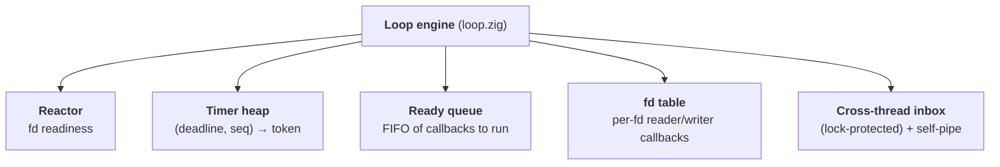
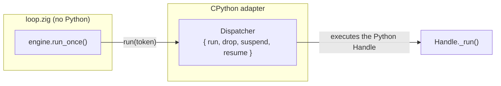

# The loop

This is the heart: `src/core/loop.zig`. It turns the [reactor](reactor.md) and a
timer heap into an actual *event loop* - the thing that runs forever, waking up
when there's work and sleeping when there isn't.

## What it owns

The engine's main pieces:

* **Ready queue** - callbacks scheduled with `call_soon`, waiting to run.
* **Timer heap** - a min-heap keyed by `(deadline, insertion order)`; the next
  thing to expire is always on top.
* **Reactor** - for fd readiness, from the [previous page](reactor.md).
* **fd table** - the reader/writer callback registered for each watched fd.
* **Cross-thread inbox** - a lock-protected queue that `call_soon_threadsafe`
  appends to, plus a self-pipe the loop watches so another thread (or a signal)
  can wake it from a blocking `poll`.

(It also keeps the running/stopping/closed state flags, of course.)

## The run-once cycle

Every iteration of the loop is one `run_once`. It's the canonical asyncio cycle,
and it's small enough to hold in your head:

A few things in that diagram carry real weight:

### Computing the timeout

The loop sleeps *exactly* as long as it should. If there's already work queued,
the timeout is `0` (don't sleep). Otherwise it's the time until the nearest
timer. Otherwise - nothing scheduled at all - it blocks forever, until I/O or a
wakeup. No busy-spinning, no oversleeping.

### Releasing the GIL :material-fire:

This is the detail that makes everything else work. While the loop is blocked in
`poll`, it **releases CPython's GIL** (`PyEval_SaveThread`) and re-acquires it
right after (`PyEval_RestoreThread`).

Without this, threads in your `run_in_executor` pool could never run, and signals
would never be delivered - the whole process would be frozen waiting on `poll`.
It's easy to get wrong, and it's why a "just call epoll" loop isn't enough.

### Inline I/O, snapshot drain for the rest

There are two kinds of callback, and they run differently. A ready fd's
**native transport callback fires inline**, right there in the I/O step - that's
how `data_received` runs without a Python round-trip. A Python-level `add_reader`
callback, by contrast, just *enqueues* a Handle onto the ready queue.

When the loop then drains the ready queue, it runs a **snapshot** of its current
length. Callbacks that schedule *more* callbacks don't get run in the same
iteration - they wait for the next turn. This is the exact fairness guarantee
asyncio makes, and it prevents one chatty callback from starving I/O.

## Dependency inversion: how Zig calls Python

Here's the elegant bit. The loop engine runs callbacks - but the callbacks are
*Python* objects, and the engine is *Zig* that doesn't know Python exists. How?

The engine is parameterized by a **dispatcher** - a little vtable the embedder
supplies:

* `run(token)` - execute the callback identified by `token`. The adapter knows
  `token` is really a pointer to a Python `Handle`, and runs it.
* `drop(token)` - release a callback that will never run (e.g. on shutdown).
* `suspend` / `resume` - the GIL release/re-acquire around the blocking poll.

The engine just calls `dispatcher.run(token)`. It has no idea a Python function
is on the other end. That's **dependency inversion**: the pure domain defines the
*interface* it needs, and the adapter plugs CPython into it.

!!! tip "Why two kinds of callbacks?"
    Deferred callbacks (`call_soon`, timers) go through the dispatcher as opaque
    tokens → Python Handles. But **I/O readiness** callbacks (a transport's
    "you can read now") are *native Zig closures* registered directly with the
    engine - so socket I/O never makes a round trip through Python just to find
    out a byte arrived. The Python `add_reader` wrapper installs a closure that
    simply enqueues a Handle. Best of both.

## Running forever, and stopping

`run_forever` is just `while (!stopping) run_once(...)`. `stop()` sets the flag
and pokes the self-pipe so a blocked `poll` returns immediately.

`run_until_complete(future)` is built on top, exactly as asyncio does it: attach
a done-callback to the future that calls `stop()`, then `run_forever`, then return
the future's result. See [Lifecycle](lifecycle.md) for the full picture.
