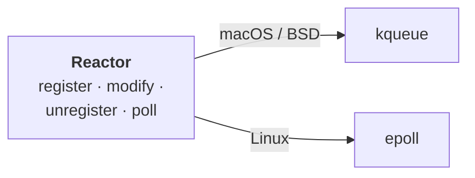
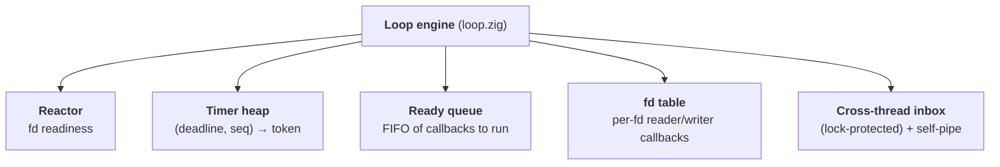
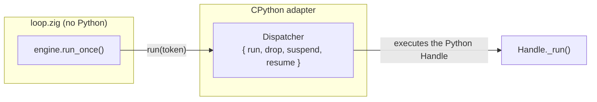

# The loop & the reactor

This is the heart of zloop: a tiny **reactor** that asks the OS *"which sockets
are ready?"*, and the **loop engine** that turns reactor readiness plus a timer
heap into an actual event loop - the thing that runs forever, waking when there's
work and sleeping when there isn't.

We'll build it bottom-up: the reactor first, then the engine on top.

## The reactor

At the very bottom sits the **reactor** - the piece that waits efficiently until
at least one watched file descriptor is ready.

This is the [Reactor pattern](https://en.wikipedia.org/wiki/Reactor_pattern), and
it's deliberately the dumbest, purest layer in the whole system. It knows about
file descriptors and readiness. It knows **nothing** about Python, callbacks,
timers, or transports.

### One interface, two backends

Operating systems expose readiness differently. zloop wraps both behind one tiny,
backend-agnostic API (`src/core/reactor.zig`):



The right backend is chosen at **compile time** from the target OS - there's no
runtime branching.

### The API

The whole reactor is four operations:

| Operation | What it does |
| --- | --- |
| `register(fd, token, interest)` | Start watching `fd` for read and/or write |
| `modify(fd, token, interest)` | Change what we're watching `fd` for |
| `unregister(fd)` | Stop watching `fd` |
| `poll(out, timeout_ns)` | Block until something is ready (or the timeout) |

A few design choices worth calling out:

* **`interest`** is a tiny bitset - `{ read, write }`. That's all the loop ever
  needs to express.
* **`token`** is an opaque `usize` the caller hands in. The reactor stores it and
  hands it straight back in the readiness event. The reactor never interprets it.
  (The loop uses the fd itself as the token, so it can find the fd's state fast.)
* **`poll`** writes results into a caller-provided buffer and returns the slice
  that was filled - no allocation in the hot path.

### What `poll` gives back

Each ready fd produces an `Event`:

```zig
pub const Event = struct {
    token: usize,    // whatever you registered
    readable: bool,  // ready to read
    writable: bool,  // ready to write
    hup: bool,       // peer hung up, or an error - let reads/writes observe it
};
```

That `hup` flag is a small but important detail: when a connection drops, the
loop wants the pending read or write to *run* and discover the EOF/error, rather
than silently doing nothing. So a hangup is reported as "go look at this fd".

### The timeout

`poll(out, timeout_ns)` is where the loop actually *sleeps*:

* `null` → block forever (until something is ready)
* `0` → don't block, just report what's ready right now
* `n` → block up to `n` nanoseconds

The loop computes this timeout from the nearest timer (see
[the run-once cycle](#the-run-once-cycle)) so it sleeps exactly as long as it
should - no busy spinning, no oversleeping.

### Tested in isolation

Because the reactor has no Python in it, it's tested as plain Zig - with real
pipes and socket pairs:

```console
$ zig build test
```

This runs unit tests for the reactor (and the timer heap, and the ready queue)
directly, without ever starting CPython. That separation is the payoff of keeping
this layer pure. 🙂

## Platform backends: kqueue vs epoll

The reactor is backend-agnostic on the surface, but underneath it talks to a
different OS mechanism on each platform: **kqueue** on macOS and the BSDs,
**epoll** on Linux. Both answer the same question - *"which of these file
descriptors are ready?"* - so they map cleanly onto one interface.

They solve the same problem and are conceptually twins. The differences are in
API shape and breadth:

| | **epoll** (Linux) | **kqueue** (macOS, BSD) |
| --- | --- | --- |
| Create | `epoll_create1()` | `kqueue()` |
| Register / modify / remove | `epoll_ctl()` - one syscall **per change** | `kevent()` - a **batch** of changelist entries |
| Wait for events | `epoll_wait()` - a separate syscall | `kevent()` - the **same** call submits changes *and* waits |
| What it can watch | fds (sockets, pipes, plus `timerfd` / `signalfd` / `eventfd`) | fds **and** timers, signals, process exit, file/vnode events - all unified |
| Interest model | one event **mask** per fd (`EPOLLIN \| EPOLLOUT`) | independent **filters** (`EVFILT_READ` and `EVFILT_WRITE` are *separate* registrations) |
| Timeout granularity | milliseconds | nanoseconds (`struct timespec`) |

The mental model: **same idea, different ergonomics.** kqueue is broader (one
mechanism for fds, timers, signals, and processes) and batches submit-and-wait
into a single call. epoll is fd-focused and leans on companion mechanisms
(`timerfd`, `signalfd`, `eventfd`) to cover what kqueue does in one place.

Three of these differences show up directly in `reactor.zig`:

1. **kqueue batches changes with the wait.** zloop accumulates registration
   changes and flushes them on the next `poll` - one `kevent()` submits them all
   and blocks for events. On epoll each change is its own `epoll_ctl` call.
2. **kqueue's read and write are separate filters; epoll's are one mask.** So
   "watch nothing on this fd" means *deleting both filters* on kqueue, but
   setting an empty mask on epoll. zloop maps empty interest to a zero epoll mask
   so a fully-unwatched fd doesn't keep firing hangup events.
3. **epoll's timeout is milliseconds; kqueue's is nanoseconds.** zloop rounds a
   sub-millisecond wait **up to 1ms** on epoll, so a tiny timer doesn't collapse
   into a zero-timeout busy-poll. kqueue needs no such rounding.

zloop deliberately does **not** push timers or signals into kqueue (even though
kqueue could host them natively). Keeping its own timer heap and a self-pipe for
signals means the timer logic is one piece of shared, cross-platform Zig, and the
two backends stay symmetric behind the same interface.

## The loop engine

On top of the reactor sits the engine: `src/core/loop.zig`. It turns the reactor
and a timer heap into an actual *event loop*.

### What it owns

The engine's main pieces:



* **Ready queue** - callbacks scheduled with `call_soon`, waiting to run.
* **Timer heap** - a min-heap keyed by `(deadline, insertion order)`; the next
  thing to expire is always on top.
* **Reactor** - for fd readiness, from above.
* **fd table** - the reader/writer callback registered for each watched fd.
* **Cross-thread inbox** - a lock-protected queue that `call_soon_threadsafe`
  appends to, plus a self-pipe the loop watches so another thread (or a signal)
  can wake it from a blocking `poll`.

(It also keeps the running/stopping/closed state flags, of course.)

### The run-once cycle

Every iteration of the loop is one `run_once`. It's the canonical asyncio cycle,
and it's small enough to hold in your head:


A few things in that diagram carry real weight:

#### Computing the timeout

The loop sleeps *exactly* as long as it should. If there's already work queued,
the timeout is `0` (don't sleep). Otherwise it's the time until the nearest
timer. Otherwise - nothing scheduled at all - it blocks forever, until I/O or a
wakeup. No busy-spinning, no oversleeping.

#### Releasing the GIL :material-fire:

This is the detail that makes everything else work. While the loop is blocked in
`poll`, it **releases CPython's GIL** (`PyEval_SaveThread`) and re-acquires it
right after (`PyEval_RestoreThread`).

Without this, threads in your `run_in_executor` pool could never run, and signals
would never be delivered - the whole process would be frozen waiting on `poll`.
It's easy to get wrong, and it's why a "just call epoll" loop isn't enough.

#### Inline I/O, snapshot drain for the rest

There are two kinds of callback, and they run differently. A ready fd's
**native transport callback fires inline**, right there in the I/O step - that's
how `data_received` runs without a Python round-trip. A Python-level `add_reader`
callback, by contrast, just *enqueues* a Handle onto the ready queue.

When the loop then drains the ready queue, it runs a **snapshot** of its current
length. Callbacks that schedule *more* callbacks don't get run in the same
iteration - they wait for the next turn. This is the exact fairness guarantee
asyncio makes, and it prevents one chatty callback from starving I/O.

### Dependency inversion: how Zig calls Python

Here's the elegant bit. The loop engine runs callbacks - but the callbacks are
*Python* objects, and the engine is *Zig* that doesn't know Python exists. How?

The engine is parameterized by a **dispatcher** - a little vtable the embedder
supplies:



* `run(token)` - execute the callback identified by `token`. The adapter knows
  `token` is really a pointer to a Python `Handle`, and runs it.
* `drop(token)` - release a callback that will never run (e.g. on shutdown).
* `suspend` / `resume` - the GIL release/re-acquire around the blocking poll.

The engine just calls `dispatcher.run(token)`. It has no idea a Python function
is on the other end. That's **dependency inversion**: the pure domain defines the
*interface* it needs, and the adapter plugs CPython into it.

!!! tip "Why two kinds of callbacks?"
    Deferred callbacks (`call_soon`, timers) go through the dispatcher as opaque
    tokens → Python Handles. But **I/O readiness** callbacks (a transport's
    "you can read now") are *native Zig closures* registered directly with the
    engine - so socket I/O never makes a round trip through Python just to find
    out a byte arrived. The Python `add_reader` wrapper installs a closure that
    simply enqueues a Handle. Best of both.

### Running forever, and stopping

`run_forever` is just `while (!stopping) run_once(...)`. `stop()` sets the flag
and pokes the self-pipe so a blocked `poll` returns immediately.

`run_until_complete(future)` is built on top, exactly as asyncio does it: attach
a done-callback to the future that calls `stop()`, then `run_forever`, then return
the future's result. See [Transports & lifecycle](transports.md) for the full
picture.
