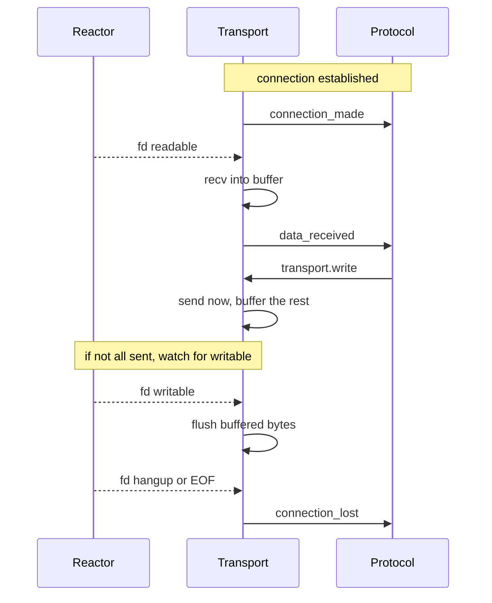

# Transports

A [transport](https://docs.python.org/3/library/asyncio-protocol.html) is the
object that sits between a socket and your `Protocol`. It moves bytes: it reads
from the socket and calls `protocol.data_received(...)`, and it takes what you
`write()` and sends it down the socket.

In zloop, the transport's byte-moving runs in **Zig** (`transport_obj.zig`),
while it speaks to your Python `Protocol` through the CPython adapter.

## The connection, end to end

When a server accepts a connection (or a client connects), here's the dance:

## Reading

When the reactor says a connection's fd is readable, the transport's native read
callback fires (no Python round-trip just to learn "data arrived"). It `recv`s
into a stack buffer and hands the bytes to your protocol's `data_received`.

If the protocol is a **buffered protocol** (`get_buffer` / `buffer_updated` - the
zero-copy style that `asyncio.sslproto` uses for TLS), the transport reads
directly into the protocol's buffer instead. Both styles are supported.

A clean EOF calls `eof_received()`; if the protocol doesn't want to keep the
connection half-open, the transport closes.

## Writing, and flow control

`transport.write(data)` tries to send immediately. If the kernel can't take it
all (a slow client, a full socket buffer), the rest is **buffered** and the
transport registers interest in "writable" - so it flushes the moment the socket
drains.

This is where **flow control** comes in. The write buffer has a high and a low
watermark:

When the buffer gets too big, the transport calls `protocol.pause_writing()`; when
it drains, `protocol.resume_writing()`. This is how a fast producer doesn't blow
up memory writing to a slow consumer - and it's exactly asyncio's contract, so
uvicorn's flow control "just works".

There's matching flow control on the read side: `pause_reading()` removes the fd
from the reactor (so no more `data_received`), and `resume_reading()` puts it
back.

## The full transport interface

The transport implements everything asyncio (and uvicorn) expects:

`write` · `writelines` · `close` · `abort` · `is_closing` · `write_eof` ·
`can_write_eof` · `pause_reading` · `resume_reading` · `set_protocol` ·
`get_protocol` · `get_extra_info` · `get_write_buffer_size` ·
`set_write_buffer_limits` · `get_write_buffer_limits`

`get_extra_info` answers the keys uvicorn asks for - `peername`, `sockname`,
`socket`, `sslcontext`, `ssl_object` - so logging and TLS introspection work.

## Two correctness details worth knowing

!!! info "connection_lost is deferred"
    asyncio never calls `connection_lost` *synchronously* from inside a `close()`
    or a `data_received` - it schedules it for the next loop iteration. zloop does
    the same. This matters more than it sounds: the WebSocket upgrade handshake in
    uvicorn calls `set_protocol()` *after* the HTTP side has already started
    closing. If `connection_lost` fired synchronously, it'd go to the wrong
    protocol. Deferring it makes the handoff land correctly.

!!! info "the loop keeps transports alive"
    An accepted connection has to stay alive even if your protocol doesn't store
    the transport anywhere. asyncio keeps transports referenced until
    `connection_lost`; zloop holds active transports in a set on the loop and
    releases them on disconnect. Without this, a protocol that forgets to stash
    `self.transport` would have its connection collected mid-flight.

These are the kinds of edge cases that don't show up in a quick demo but absolutely
show up in a real server - so they're tested. 🙂
