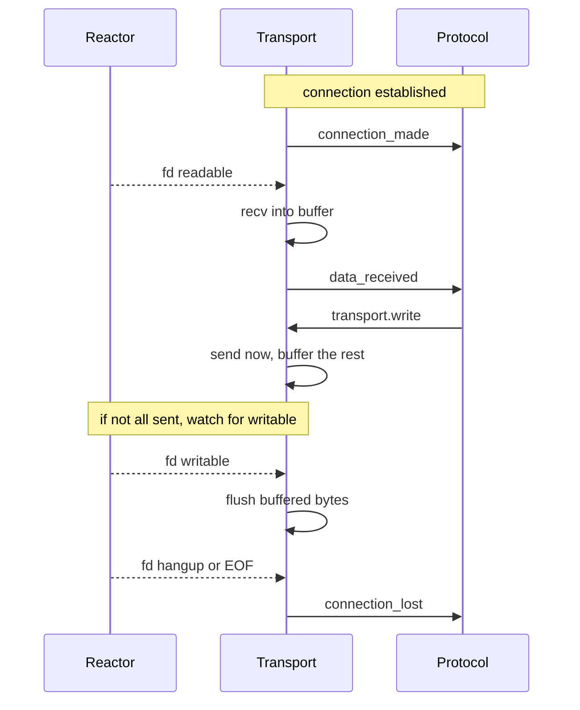
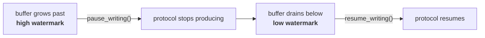
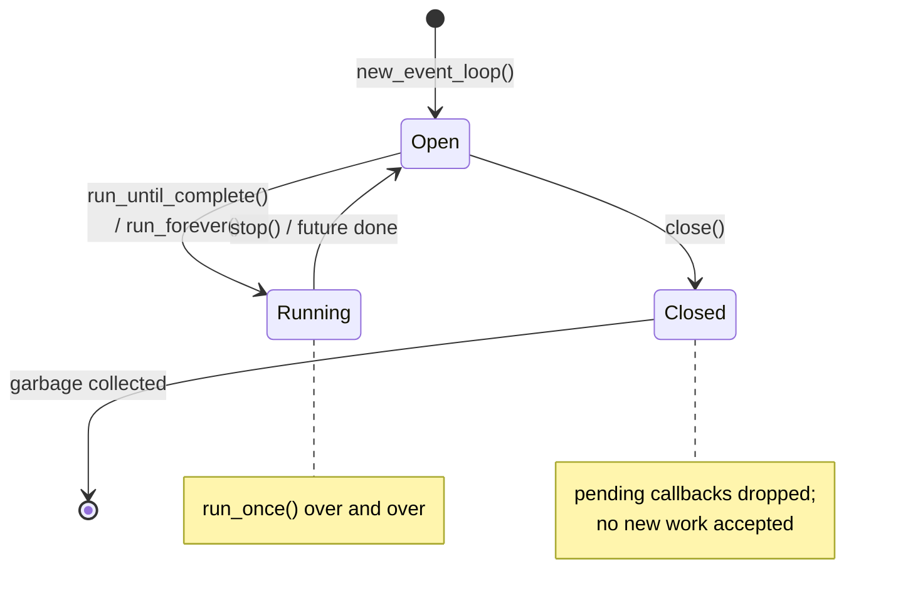
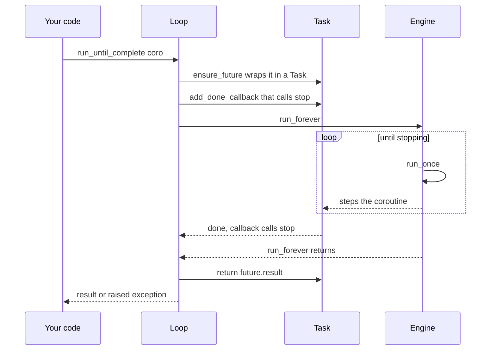

# Transports & lifecycle

This page covers the two remaining pieces of the story: how a **transport** moves
bytes between a socket and your `Protocol`, and how a **loop** lives from birth to
death.

## Transports

A [transport](https://docs.python.org/3/library/asyncio-protocol.html) is the
object that sits between a socket and your `Protocol`. It moves bytes: it reads
from the socket and calls `protocol.data_received(...)`, and it takes what you
`write()` and sends it down the socket.

In zloop, the transport's byte-moving runs in **Zig** (`transport_obj.zig`),
while it speaks to your Python `Protocol` through the CPython adapter.

### The connection, end to end

When a server accepts a connection (or a client connects), here's the dance:



### Reading

When the reactor says a connection's fd is readable, the transport's native read
callback fires (no Python round-trip just to learn "data arrived"). It `recv`s
into a stack buffer and hands the bytes to your protocol's `data_received`.

If the protocol is a **buffered protocol** (`get_buffer` / `buffer_updated` - the
zero-copy style that `asyncio.sslproto` uses for TLS), the transport reads
directly into the protocol's buffer instead. Both styles are supported.

A clean EOF calls `eof_received()`; if the protocol doesn't want to keep the
connection half-open, the transport closes.

### Writing, and flow control

`transport.write(data)` tries to send immediately. If the kernel can't take it
all (a slow client, a full socket buffer), the rest is **buffered** and the
transport registers interest in "writable" - so it flushes the moment the socket
drains.

This is where **flow control** comes in. The write buffer has a high and a low
watermark:



When the buffer gets too big, the transport calls `protocol.pause_writing()`; when
it drains, `protocol.resume_writing()`. This is how a fast producer doesn't blow
up memory writing to a slow consumer - and it's exactly asyncio's contract, so
uvicorn's flow control "just works".

There's matching flow control on the read side: `pause_reading()` removes the fd
from the reactor (so no more `data_received`), and `resume_reading()` puts it
back.

!!! note "On the completion backend"
    The reading/writing described here is the **readiness** path (the default).
    With the opt-in io_uring [completion backend](the-loop.md#the-completion-backend-io_uring), reads come from a
    kernel-filled buffer (multishot recv, no per-message `recv`) and writes are
    submitted as `SEND` on the ring rather than a synchronous `write()`. The
    transport interface and flow-control contract above are identical either way;
    only the mechanics underneath differ. Buffered/SSL protocols stay on the
    readiness path even when io_uring is enabled.

### The full transport interface

The transport implements everything asyncio (and uvicorn) expects:

`write` · `writelines` · `close` · `abort` · `is_closing` · `write_eof` ·
`can_write_eof` · `pause_reading` · `resume_reading` · `set_protocol` ·
`get_protocol` · `get_extra_info` · `get_write_buffer_size` ·
`set_write_buffer_limits` · `get_write_buffer_limits`

`get_extra_info` answers the keys uvicorn asks for. The raw socket transport
provides `socket`, `sockname`, `peername`, and `sslcontext` (for a TLS server).
On a TLS connection the app-facing transport is `asyncio.sslproto`'s, which adds
the usual `ssl_object` / `peercert` after the handshake - so logging and TLS
introspection work.

### Two correctness details worth knowing

!!! info "connection_lost is deferred"
    asyncio never calls `connection_lost` *synchronously* from inside a `close()`
    or a `data_received` - it schedules it for the next loop iteration. zloop does
    the same. This matters more than it sounds: the WebSocket upgrade handshake in
    uvicorn calls `set_protocol()` *after* the HTTP side has already started
    closing. If `connection_lost` fired synchronously, it'd go to the wrong
    protocol. Deferring it makes the handoff land correctly.

!!! info "the loop keeps transports alive"
    An accepted connection has to stay alive even if your protocol doesn't store
    the transport anywhere. asyncio keeps transports referenced until
    `connection_lost`; zloop holds active transports in a set on the loop and
    releases them on disconnect. Without this, a protocol that forgets to stash
    `self.transport` would have its connection collected mid-flight.

These are the kinds of edge cases that don't show up in a quick demo but absolutely
show up in a real server - so they're tested. 🙂

## Loop lifecycle

Now let's trace a loop from birth to death, so the pieces from the previous pages
connect into one story.

### States



A loop is **Open** when created, becomes **Running** while it's driving
callbacks, returns to **Open** when stopped, and is **Closed** for good once you
`close()` it.

### `run_until_complete`, step by step

This is the method `asyncio.run()` ultimately calls. zloop implements it exactly
the way asyncio does:



The trick is the done-callback: when the wrapped task finishes, it calls
`loop.stop()`, which breaks the `run_forever` loop. Then `run_until_complete`
returns the task's result - or re-raises its exception.

If the loop is stopped *before* the future completes, zloop raises a clear
`RuntimeError("Event loop stopped before Future completed.")`, matching asyncio
rather than leaking an obscure internal error.

### Shutdown and cleanup

`asyncio.run()` does a tidy shutdown sequence, and zloop participates in all of
it:

1. cancel any remaining tasks and let them finish cancelling,
2. `await loop.shutdown_asyncgens()` - a no-op today: zloop doesn't install
   asyncgen finalizer hooks, so this is a compatibility placeholder (the method
   exists and is safe to call),
3. `await loop.shutdown_default_executor()` - drain the thread pool,
4. `loop.close()`.

That last `close()` does something important for memory: it **drops the engine's
pending callbacks and timers**. This breaks a reference cycle - the engine holds
pending callback handles, and each handle holds a reference back to the loop - so
that once you're done, the loop can be garbage-collected cleanly.

!!! tip "Always close your loop"
    If you create a loop by hand, `close()` it when you're done (a `try/finally`
    is the idiom). `asyncio.run()` and `asyncio.Runner` do this for you - which is
    why they're the recommended way to run things. A loop that's *abandoned*
    without being closed, while callbacks are still pending, can't break that
    cycle and will leak.

### After close

A closed loop is inert and says so. Calling `call_soon`, `call_later`,
`add_reader`, or `create_server` on a closed loop raises
`RuntimeError("Event loop is closed")` - exactly like asyncio. No silent enqueuing
onto a loop that will never run again.

```python
import asyncio

import zloop

loop = zloop.new_event_loop()
loop.close()

loop.call_soon(print, "nope")
#> RuntimeError: Event loop is closed
```

And that's the whole life of a zloop loop. 🙂
