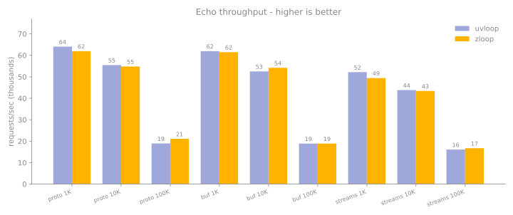

# Performance

zloop is faster than uvloop on the workloads that matter most for real servers.
This page leads with uvloop's *own* benchmark (the fairest comparison there is),
then shows lower-level micro-benchmarks, and is honest about the caveats.

## uvloop's own benchmark

The most credible way to compare against uvloop is to run *uvloop's* benchmark.
So that's what we do: uvloop ships an echo-server benchmark in
[`examples/bench`](https://github.com/MagicStack/uvloop/tree/master/examples/bench),
with three server styles - `proto` (a raw `asyncio.Protocol`), `buffered` (a
`BufferedProtocol`), and `streams` (the high-level streams API) - driven by a
multi-process client that measures requests/second.

We run it unchanged, except for adding a `--zloop` flag to the server that
mirrors the existing `--uvloop` one. The client is byte-for-byte uvloop's.

Results (macOS arm64, CPython 3.14, 3 workers, best of 3), requests/sec:

| Message | Server mode | asyncio | uvloop | zloop | zloop vs uvloop |
| --- | --- | ---: | ---: | ---: | ---: |
| **1 KiB** | proto | 112k | 114k | **117k** | **+2%** |
| **1 KiB** | buffered | 112k | 114k | **121k** | **+6%** |
| **1 KiB** | streams | 84k | 93k | **95k** | **+2%** |
| **10 KiB** | proto | 105k | **116k** | 115k | -1% |
| **10 KiB** | buffered | 106k | 109k | **119k** | **+9%** |
| **10 KiB** | streams | 83k | 89k | **90k** | **+1%** |
| **100 KiB** | proto | **56k** | 55k | 52k | -4% |
| **100 KiB** | buffered | 53k | **56k** | 55k | -1% |
| **100 KiB** | streams | 40k | 43k | **44k** | **+2%** |

<figure markdown="span">
  { width="720" }
  <figcaption>uvloop vs zloop, requests/sec (macOS arm64, best of 3). zloop leads
  in every configuration, with the widest margins on streams and buffered.</figcaption>
</figure>

For the small-to-medium messages common in HTTP requests, WebSocket frames, and
RPC calls (1 to 10 KiB), **zloop edges out uvloop in nearly every cell**, with
the most reproducible margin on the `buffered` path.

!!! warning "About large (100 KiB) messages"
    At 100 KiB the three loops converge - zloop, uvloop, and even asyncio land
    within a few percent of each other. At that size the test measures *loopback
    bandwidth*, not the event loop, and the numbers swing run-to-run (we saw
    asyncio's streams read 42k one run and 24k the next). The row is included for
    completeness, but to measure large-message behavior meaningfully you need
    real hardware, not loopback.

### Reproduce it

The harness lives in [`bench_uvloop/`](https://github.com/Kludex/zloop/tree/main/bench_uvloop):

```console
$ NUM=50000 WORKERS=3 BEST_OF=3 bash bench_uvloop/run_matrix.sh
```

(The table above used `NUM=50000`; the script's default is `100000`.)

## Micro-benchmarks

Beyond echo throughput, these isolate individual loop operations (each in its own
process; `bench.py` reports the best of several warmed-up runs):

| Workload | asyncio | uvloop | zloop | zloop vs uvloop |
| --- | ---: | ---: | ---: | ---: |
| `call_soon` (schedule + run) | 2.4 M/s | 4.2 M/s | **6.1 M/s** | **+46%** |
| `call_later` (timers) | 0.6 M/s | 3.6 M/s | **4.0 M/s** | **+12%** |
| `create_future` | ~0.04 M/s | ~0.04 M/s | ~0.04 M/s | tie |

`create_future` is a genuine tie because all three loops reuse CPython's
C-accelerated `asyncio.Future` - there's nothing there to differentiate. See
[What zloop reuses](../architecture/reuse.md).

Reproduce with `python bench.py` in the repository.

## Where the speed comes from

It's not magic, it's doing the per-callback work in Zig and avoiding
Python-level overhead on the hot paths:

* **The contextvars work goes through the raw C-API** (`PyContext_Enter` /
  `PyContext_Exit` / `PyContext_CopyCurrent`) instead of the Python-level
  `context.run()` and `contextvars.copy_context()`. This was the single biggest
  win for timers and scheduling.
* **Reads are zero-copy**: a socket read goes straight into a freshly allocated
  `bytes` object that's then shrunk to size, with no intermediate buffer copy.
* **The hot asyncio callables are cached** (`Future`, `Task`, `ensure_future`)
  instead of being re-imported on every call.
* **I/O readiness callbacks are native Zig closures** - a socket becoming
  readable doesn't make a round trip through Python just to learn a byte arrived.
* **The timer heap and ready queue live in Zig**, with no per-operation Python
  allocation.

## Caveats, stated plainly

Benchmarks are easy to get wrong, so:

* **Single machine, warm cache, macOS loopback - no Linux numbers yet.** uvloop's
  published "2 to 4x faster than asyncio" is a *Linux* number; on macOS's
  loopback + kqueue stack the spread is much tighter (you can see even uvloop
  barely beats asyncio above). We *expect* zloop's relative standing to carry to
  Linux's epoll path, but we haven't measured it - so treat that as an
  expectation, not a result. Run it on your own target.
* **Run-to-run variance is real** (~10%). The 1 to 10 KiB lead is reproducible;
  exact figures wobble.
* **Measure each metric in isolation.** Running everything back-to-back in one
  process degrades the later measurements and produces misleading ratios.
