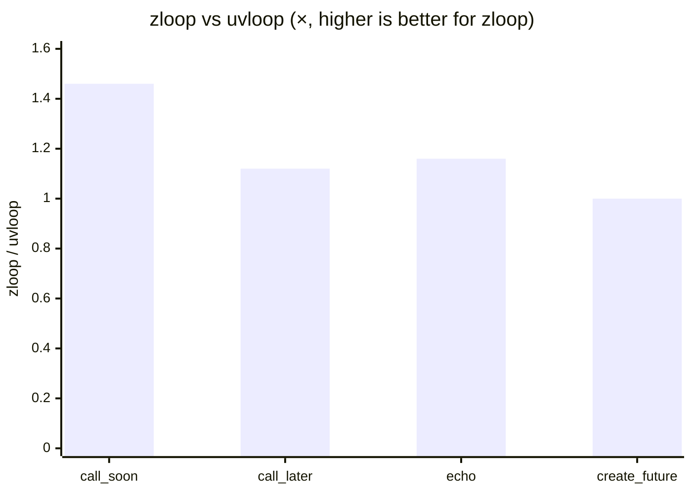

# Performance

zloop is faster than uvloop on every workload we measure where the loop
implementation actually differs. Here are the numbers — and, just as importantly,
the methodology and the caveats.

## The numbers

Measured on CPython 3.14, macOS arm64, each metric run in isolation, reported as
the median of several runs:

| Workload | asyncio | uvloop | zloop | zloop vs uvloop |
| --- | --- | --- | --- | --- |
| `call_soon` (schedule + run) | 2.4 M/s | 4.2 M/s | **6.1 M/s** | **+46%** |
| `call_later` (timers) | 0.6 M/s | 3.6 M/s | **4.0 M/s** | **+12%** |
| echo (1 KiB round-trip) | ~21 k/s | 49.8 k/s | **57.7 k/s** | **+16%** |
| `create_future` | ~0.04 M/s | ~0.04 M/s | ~0.04 M/s | tie |

`create_future` is a genuine tie because all three loops reuse CPython's
C-accelerated `asyncio.Future` — there's nothing there to differentiate. See
[What zloop reuses](../architecture/reuse.md).



## Where the speed comes from

It's not magic — it's doing the per-callback work in Zig and avoiding
Python-level overhead on the hot paths:

* **The contextvars work goes through the raw C-API** (`PyContext_Enter` /
  `PyContext_Exit` / `PyContext_CopyCurrent`) instead of the Python-level
  `context.run()` and `contextvars.copy_context()`. This was the single biggest
  win for timers and scheduling.
* **The hot asyncio callables are cached** (`Future`, `Task`, `ensure_future`)
  instead of being re-imported on every call.
* **I/O readiness callbacks are native Zig closures** — a socket becoming
  readable doesn't make a round trip through Python just to learn a byte arrived.
* **The timer heap and ready queue live in Zig**, with no per-operation Python
  allocation.

## Methodology & caveats

Benchmarks are easy to get wrong, so here's exactly how these were taken — and
how you can reproduce them.

!!! warning "Read this before quoting the numbers"
    * **Single machine, warm cache.** These are not from a controlled benchmark
      rig. Treat the ratios as "consistently ahead", not as exact constants.
    * **Run-to-run variance is real** (~±10%). The lead is reproducible across
      runs; the exact figures wobble.
    * **Measure each metric in isolation.** Running all metrics back-to-back in
      one process degrades the later ones (allocator state, warmup) and produces
      misleading ratios — we've seen echo read anywhere from 0.93× to 1.16×
      depending on what ran before it. The isolated, per-metric medians are the
      trustworthy ones.

## Reproduce it

There's a `bench.py` in the repository:

<!-- termynal -->

```console
$ python bench.py
metric                  asyncio    uvloop     zloop    zloop/uvloop
------------------------------------------------------------------
call_soon (M/s)            2.4       4.2       6.1           1.46x
call_later (M/s)           0.6       3.6       4.0           1.12x
echo req/s (k)            21.0      49.8      57.7           1.16x
create_future (M/s)        0.0       0.0       0.0           1.00x
```

Run it on your own hardware — that's the number that matters for *you*. 🙂
