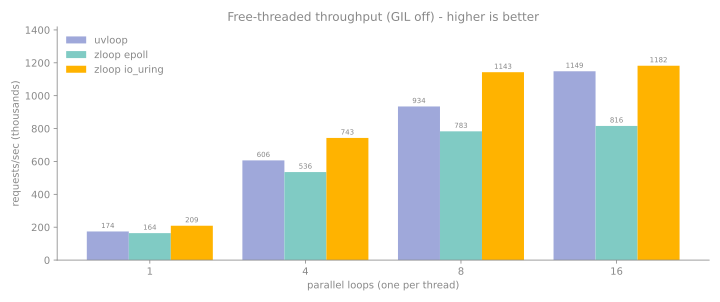

# Performance

zloop is faster than uvloop on the workloads that matter most for real servers.
This page leads with uvloop's *own* benchmark (the fairest comparison there is),
then shows lower-level micro-benchmarks, and is honest about the caveats.

## uvloop's own benchmark

The most credible way to compare against uvloop is to run *uvloop's* benchmark.
So that's what we do: uvloop ships an echo-server benchmark in
[`examples/bench`](https://github.com/MagicStack/uvloop/tree/master/examples/bench),
with three server styles - `proto` (a raw `asyncio.Protocol`), `buffered` (a
`BufferedProtocol`), and `streams` (the high-level streams API) - driven by a
multi-process client that measures requests/second.

We run it unchanged, except for adding a `--zloop` flag to the server that
mirrors the existing `--uvloop` one. The client is byte-for-byte uvloop's.

zloop has two backends - the default readiness reactor (epoll/kqueue) and the
opt-in io_uring **completion** backend (`ZLOOP_IO_URING=completion`, Linux only).
Both are shown in every table below; the **fastest** in each row is bold.

### Single loop (the default, GIL on)

Results (Linux, CPython 3.14, 3 workers, best of 3), requests/sec:

<figure markdown="span">
  { width="720" }
  <figcaption>uvloop vs zloop (epoll), requests/sec. The chart is regenerated by
  the Benchmark CI workflow on every push to main.</figcaption>
</figure>

| mode    | size    | asyncio | uvloop  | zloop epoll | zloop io_uring |
| ------- | ------: | ------: | ------: | ----------: | -------------: |
| proto   | 1 KB    | 135,393 | 127,872 |     132,223 |    **138,778** |
| proto   | 100 KiB |  61,441 |  57,158 |  **66,188** |         22,280 |
| streams | 1 KB    | 105,250 | 116,043 | **122,236** |        116,720 |
| streams | 100 KiB |  43,312 |  40,582 |  **46,862** |         19,679 |

For a single GIL-bound loop the **default epoll backend beats uvloop**. The
io_uring completion backend is *slower* here: its submit/reap overhead and the
64 KiB buffer-ring copy aren't amortized when one serialized loop is the
bottleneck, and it fragments 100 KiB messages badly. Completion's win is parallel
free-threaded loops (below).

!!! warning "About large (100 KiB) messages"
    At 100 KiB the readiness loops converge - zloop epoll, uvloop, and even
    asyncio land within a few percent of each other. At that size the test
    measures *loopback bandwidth*, not the event loop, and the numbers swing
    run-to-run (we saw asyncio's streams read 42k one run and 24k the next). The
    row is included for completeness, but to measure large-message behavior
    meaningfully you need real hardware, not loopback.

### Free-threaded parallel loops (GIL off)

Under free-threaded CPython (3.14t), N independent loops on N threads stop being
serialized by the GIL - and the completion backend, whose io_uring path is leaner,
**beats uvloop at every thread count** (and beats zloop's own epoll default
everywhere).

N loops on N threads, 8 conns/thread, 1 KB messages, Linux io_uring kernel 6.10,
3-sample medians on a 12-CPU host, requests/sec:

<figure markdown="span">
  { width="720" }
  <figcaption>N parallel loops (one per thread) on free-threaded CPython, GIL
  off. The io_uring completion backend leads at every thread count.</figcaption>
</figure>

| loops | uvloop    | zloop epoll | zloop io_uring |
| ----: | --------: | ----------: | -------------: |
|     1 |   174,185 |     163,900 |    **209,071** |
|     4 |   606,261 |     535,556 |    **742,847** |
|     8 |   934,289 |     783,205 |  **1,142,655** |
|    16 | 1,148,609 |     815,971 |  **1,182,234** |

The wins come from keeping the io_uring path lean: **batched submits** (one
`io_uring_enter` per loop turn, not per op), **multishot recv**,
**completion-path writes** (SEND on the ring, no per-message `write()`), and a
**cached `protocol.data_received`** (a per-message attribute lookup was taking
per-object locks and causing a `sched_yield` storm across parallel free-threaded
loops). uvloop runs here too - it imports on 3.14t without forcing the GIL back
on and drives one loop per thread.

!!! note "These io_uring numbers are directional"
    The completion backend is Linux-only and these results were measured in a
    kernel-6.10 VM, not on bare metal. The 16-loop margin (+3%) is the thinnest
    and noisiest - 16 loops oversubscribe the 12-core host - so the solid wins
    are at 1-8 loops.

### Reproduce it

The harness lives in [`bench_uvloop/`](https://github.com/Kludex/zloop/tree/main/bench_uvloop):

```console
$ NUM=50000 WORKERS=3 BEST_OF=5 bash bench_uvloop/run_matrix.sh
```

CI runs the same matrix via `bench_uvloop/bench_ci.py` and writes
`bench_uvloop/results.json`, from which `docs/render_bench.py` regenerates the
chart and both tables. (The chart and CI table cover the single-loop matrix; the
free-threaded numbers come from `bench_uvloop/ft_parallel_bench.py` on a
`python3.14t` build with `ZLOOP_IO_URING=completion`.)

## Micro-benchmarks

Beyond echo throughput, these isolate individual loop operations (each in its own
process; `bench.py` reports the best of several warmed-up runs):

| Workload | asyncio | uvloop | zloop | zloop vs uvloop |
| --- | ---: | ---: | ---: | ---: |
| `call_soon` (schedule + run) | 2.4 M/s | 4.2 M/s | **6.1 M/s** | **+46%** |
| `call_later` (timers) | 0.6 M/s | 3.6 M/s | **4.0 M/s** | **+12%** |
| `create_future` | ~0.04 M/s | ~0.04 M/s | ~0.04 M/s | tie |

`create_future` is a genuine tie because all three loops reuse CPython's
C-accelerated `asyncio.Future` - there's nothing there to differentiate. See
[What zloop reuses](../architecture/reuse.md).

Reproduce with `python bench.py` in the repository.

## Where the speed comes from

It's not magic, it's doing the per-callback work in Zig and avoiding
Python-level overhead on the hot paths:

* **The contextvars work goes through the raw C-API** (`PyContext_Enter` /
  `PyContext_Exit` / `PyContext_CopyCurrent`) instead of the Python-level
  `context.run()` and `contextvars.copy_context()`. This was the single biggest
  win for timers and scheduling.
* **Reads are zero-copy**: a socket read goes straight into a freshly allocated
  `bytes` object that's then shrunk to size, with no intermediate buffer copy.
* **The hot asyncio callables are cached** (`Future`, `Task`, `ensure_future`)
  instead of being re-imported on every call.
* **I/O readiness callbacks are native Zig closures** - a socket becoming
  readable doesn't make a round trip through Python just to learn a byte arrived.
* **The timer heap and ready queue live in Zig**, with no per-operation Python
  allocation.

## Caveats, stated plainly

Benchmarks are easy to get wrong, so:

* **Loopback, not the network.** These numbers come from a single GitHub Actions
  Linux runner over loopback. uvloop's published "2 to 4x faster than asyncio" is
  a *Linux* number too, but on a shared loopback the spread is much tighter (even
  uvloop barely beats asyncio above). Run it on your own target before relying on
  the exact figures.
* **Run-to-run variance is real** (~10%). The 1 to 10 KiB lead is reproducible;
  exact figures wobble.
* **Measure each metric in isolation.** Running everything back-to-back in one
  process degrades the later measurements and produces misleading ratios.
* **The io_uring completion backend is Linux-only** and its free-threaded numbers
  were measured in a kernel-6.10 VM, not on bare metal - treat the parallel-loop
  speedups as directional, and confirm on your own hardware.
