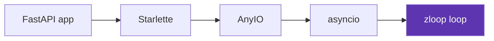

# With FastAPI & Starlette

[FastAPI](https://fastapi.tiangolo.com) and
[Starlette](https://www.starlette.io) are ASGI applications. They don't run a
loop themselves — the **server** does (that's [uvicorn](uvicorn.md)). So
"using zloop with FastAPI" really means "run your FastAPI app with uvicorn on
zloop".

## The app

Nothing changes in your application. Write FastAPI exactly as you always do:

```python title="app.py"
from fastapi import FastAPI

app = FastAPI()


@app.get("/")
async def root():
    return {"message": "Hello from a Zig event loop 👋"}
```

## Run it on zloop

Just point uvicorn at zloop's loop factory:

```console
$ uvicorn app:app --loop zloop:new_event_loop
INFO:     Uvicorn running on http://127.0.0.1:8000 (Press CTRL+C to quit)
```

Or from Python:

```python title="run.py"
import uvicorn

uvicorn.run("app:app", loop="zloop:new_event_loop")
```

That's it. Your routes, dependencies, middleware, background tasks, and
WebSocket endpoints all run on zloop. ✨

## Why nothing else changes



FastAPI is built on Starlette, Starlette on AnyIO, AnyIO on asyncio — and the
asyncio loop, at the very bottom, is the one uvicorn created for you: **zloop**.

Each layer only ever asks for "the running loop". Swap the loop at the bottom and
the entire stack runs on it, untouched. That's the beauty of asyncio's design —
and the reason a drop-in loop like zloop is even possible. 🙂

!!! tip "Want to verify it's actually zloop?"
    Add a tiny endpoint while you're poking around:

    ```python
    import asyncio


    @app.get("/loop")
    async def which_loop():
        return {"loop": type(asyncio.get_running_loop()).__module__}
    ```

    Hit `/loop` and you'll see `"zloop"`. 😄
