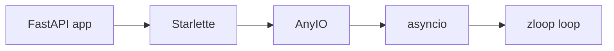

# Servers & clients

These all share one idea: **you pick the loop once, at the top, and everything
underneath runs on it.** A server picks it for your whole app; a script picks it
for every client library it uses. This page walks through both sides.

## uvicorn

[uvicorn](https://www.uvicorn.org) is probably *the* reason you're here. It's the
ASGI server that runs FastAPI, Starlette, and friends - and it lets you choose
the event loop it runs on.

zloop passes uvicorn's **entire test suite**, so it's a true drop-in.

### The CLI

uvicorn's `--loop` flag accepts an import string pointing at a loop factory. Point
it at zloop:

```console
$ uvicorn app:app --loop zloop:new_event_loop
INFO:     Started server process [12345]
INFO:     Uvicorn running on http://127.0.0.1:8000 (Press CTRL+C to quit)
```

That's the whole integration. `asyncio` and `uvloop` are built-in *names* in
uvicorn; for anything else you give it an import string, `module:callable` -
which is the path zloop uses.

!!! tip "How `--loop` resolves"
    uvicorn keeps built-in names (`auto`, `asyncio`, `uvloop`). For anything
    else, it treats the value as an import string and imports the factory. So
    `zloop:new_event_loop` simply imports `zloop.new_event_loop` and calls it to
    build each worker's loop. `auto` mode prefers `uvloop` if installed, otherwise
    `asyncio` - it doesn't know about zloop, so ask for zloop explicitly.

### In code (`Config`)

If you run uvicorn programmatically, set `loop` on the `Config`:

```python title="server.py" hl_lines="12"
import uvicorn


async def app(scope, receive, send):
    assert scope["type"] == "http"
    await send({"type": "http.response.start", "status": 200,
                "headers": [(b"content-type", b"text/plain")]})
    await send({"type": "http.response.body", "body": b"Hello from zloop 👋"})


if __name__ == "__main__":
    uvicorn.run(app, host="127.0.0.1", port=8000, loop="zloop:new_event_loop")  # (1)!
```

1.  Exactly the value you'd pass on the CLI, just as a keyword argument.

### Does everything work?

Yes - this is the part we're most confident about, because it's continuously
verified:

* HTTP/1.1 (both the `h11` and `httptools` protocols)
* WebSockets (`websockets` and `wsproto`)
* HTTPS / TLS
* Unix domain sockets
* Graceful shutdown and signal handling
* The `--workers` multiprocess model

zloop runs uvicorn's full suite - **1048 tests** - with the same result as the
default asyncio loop. If uvicorn works for you on asyncio, it works on zloop.

## FastAPI & Starlette

[FastAPI](https://fastapi.tiangolo.com) and
[Starlette](https://www.starlette.io) are ASGI applications. They don't run a
loop themselves - the **server** does (that's uvicorn, above). So "using zloop
with FastAPI" really means "run your FastAPI app with uvicorn on zloop".

Nothing changes in your application. Write FastAPI exactly as you always do, then
point uvicorn at zloop's loop factory:

```python title="app.py"
from fastapi import FastAPI

app = FastAPI()


@app.get("/")
async def root():
    return {"message": "Hello from a Zig event loop 👋"}
```

```console
$ uvicorn app:app --loop zloop:new_event_loop
INFO:     Uvicorn running on http://127.0.0.1:8000 (Press CTRL+C to quit)
```

That's it. Your routes, dependencies, middleware, background tasks, and
WebSocket endpoints all run on zloop. ✨

### Why nothing else changes



FastAPI is built on Starlette, Starlette on AnyIO, AnyIO on asyncio - and the
asyncio loop, at the very bottom, is the one uvicorn created for you: **zloop**.

Each layer only ever asks for "the running loop". Swap the loop at the bottom and
the entire stack runs on it, untouched. That's the beauty of asyncio's design -
and the reason a drop-in loop like zloop is even possible. 🙂

!!! tip "Want to verify it's actually zloop?"
    Add a tiny endpoint while you're poking around:

    ```python
    import asyncio


    @app.get("/loop")
    async def which_loop():
        return {"loop": type(asyncio.get_running_loop()).__module__}
    ```

    Hit `/loop` and you'll see `"zloop"`. 😄

## HTTP clients

zloop is a client-side loop too. Libraries that do their network I/O over
asyncio's TCP/TLS transports - [HTTPX](https://www.python-httpx.org),
[aiohttp](https://docs.aiohttp.org), and most database drivers and message-queue
clients - run on it.

You don't configure the library. You just run your code on a zloop loop, and the
library uses whatever loop is running.

```python title="httpx_example.py"
import asyncio

import httpx

import zloop


async def main():
    async with httpx.AsyncClient() as client:
        r = await client.get("https://example.com")
        print(r.status_code)  #> 200


asyncio.run(main(), loop_factory=zloop.new_event_loop)
```

HTTPX's async transport runs on the current event loop - which is zloop. TLS,
connection pooling, timeouts: all handled by zloop's transports under the hood.
aiohttp is the same story - run it on a zloop loop and its `ClientSession` uses it
automatically.

## The general pattern

This is the recurring theme, and it's worth saying once clearly:

!!! quote "The whole integration story"
    You pick the loop **once**, at the top - with uvicorn's `--loop` for a server,
    or `loop_factory` for a script. After that, every async library in your
    program runs on it automatically, because they all ask asyncio for "the
    running loop", and that loop is zloop.

So there's no per-library setup. If it's asyncio, it's zloop-compatible.
